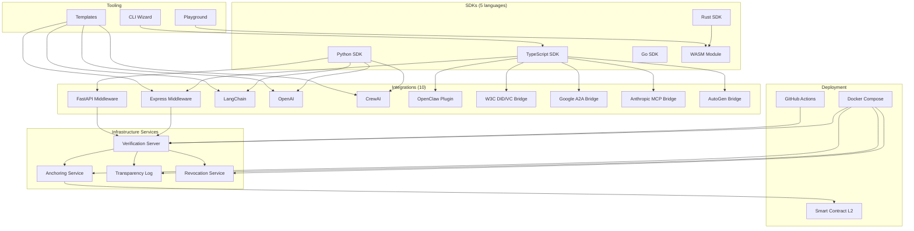

<sub>[English](README.md) · [中文](README.zh-CN.md) · **Español** · [日本語](README.ja.md) · [Português](README.pt-BR.md)</sub>

<div align="center">

# DCP-AI — Digital Citizenship Protocol for AI Agents

### Una capa portable de rendición de cuentas para agentes de IA en redes abiertas

[](#protocol-specifications)
[](LICENSE)
[](https://github.com/dcp-ai-protocol/dcp-ai/actions/workflows/ci.yml)
[](https://codecov.io/gh/dcp-ai-protocol/dcp-ai)
[](https://doi.org/10.5281/zenodo.19040913)
[](https://doi.org/10.5281/zenodo.19656026)

[](https://www.npmjs.com/package/@dcp-ai/sdk)
[](https://www.npmjs.com/package/@dcp-ai/cli)
[](https://www.npmjs.com/package/@dcp-ai/wasm)
[](https://pypi.org/project/dcp-ai/)
[](https://crates.io/crates/dcp-ai)
[](https://pkg.go.dev/github.com/dcp-ai-protocol/dcp-ai/sdks/go/v2)
[](https://github.com/dcp-ai-protocol/dcp-ai/pkgs/container/dcp-ai%2Fverification)

</div>

---

## ¿Qué es DCP?

El **Digital Citizenship Protocol (DCP)** define una capa portable de rendición de cuentas para agentes de IA, que permite a cualquier verificador evaluar:

- **Quién es responsable** de un agente (vinculación al Principal Responsable),
- **Qué declaró el agente** que pretendía hacer (Declaración de Intención),
- **Qué decisión de política** se aplicó (Decisión de Política),
- **Qué evidencia verificable** se produjo (Pista de Auditoría),
- **Cómo se gestionan los agentes** a lo largo de su ciclo de vida (Gestión del Ciclo de Vida),
- **Qué ocurre cuando los agentes transicionan** o son dados de baja (Sucesión Digital),
- **Cómo se resuelven los conflictos** entre agentes y principales (Resolución de Disputas),
- **Qué derechos y obligaciones** rigen el comportamiento del agente (Marco de Derechos), y
- **Cómo se delega la autoridad** de los humanos a los agentes (Representación Personal).

Todos los artefactos están firmados criptográficamente, encadenados por hash y verificables de manera independiente — sin requerir una autoridad central.

> Este protocolo fue co-creado por un humano y un agente de IA — diseñado para la colaboración que busca gobernar.

---

## Arquitectura

DCP se organiza en tres capas conceptuales:

### DCP Core

El **protocolo mínimo interoperable** que toda implementación debe soportar. Core define los artefactos, sus relaciones y el modelo de verificación:

- **Vinculación al Principal Responsable** — enlaza cada agente a una entidad humana o legal que asume la rendición de cuentas
- **Pasaporte del Agente** — identidad portable, capacidades y material de clave del agente
- **Declaración de Intención** — declaración estructurada de lo que el agente pretende hacer, antes de actuar
- **Resultado de Política** — la decisión de autorización aplicada a una intención
- **Evidencia de Acción** — entradas de auditoría encadenadas por hash, con evidencia de manipulación y pruebas de Merkle
- **Manifiesto del Bundle** — el paquete portable que vincula todos los artefactos para su verificación

Consulta [spec/core/](spec/core/) para la especificación del core.

### Perfiles

**Extensiones y especializaciones** que se construyen sobre el core pero no son obligatorias para la interoperabilidad básica:

- **Perfil Crypto** — selección de algoritmos, firmas híbridas post-cuánticas, cripto-agilidad, política del verificador ([spec/profiles/crypto/](spec/profiles/crypto/))
- **Perfil Entre Agentes (A2A)** — descubrimiento, handshake, gestión de sesiones, bindings de transporte ([spec/profiles/a2a/](spec/profiles/a2a/))
- **Perfil Governance** — niveles de riesgo, atestación de jurisdicción, revocación, recuperación de claves, ceremonias de gobernanza ([spec/profiles/governance/](spec/profiles/governance/))

### Servicios

**Infraestructura operacional** que soporta el protocolo pero no forma parte del core normativo:

- Servidores de verificación, servicios de anclaje, logs de transparencia, registros de revocación
- Son decisiones de despliegue, no requisitos del protocolo

---

## Especificaciones del Protocolo

| Spec | Título | Descripción |
|------|-------|-------------|
| [DCP-01](spec/DCP-01.md) | Identidad y Vinculación Humana | Identidad del agente, atestación del operador, vinculación de clave |
| [DCP-02](spec/DCP-02.md) | Declaración de Intención y Control de Política | Intenciones declaradas, aplicación de niveles de seguridad, evaluación de política |
| [DCP-03](spec/DCP-03.md) | Cadena de Auditoría y Transparencia | Entradas de auditoría encadenadas por hash, pruebas de Merkle, logs de transparencia |
| [DCP-04](spec/DCP-04.md) | Comunicación Entre Agentes | Mensajería inter-agente autenticada, delegación, cadenas de confianza |
| [DCP-05](spec/DCP-05.md) | Gestión del Ciclo de Vida del Agente | Comisionar, monitorear, declinar y dar de baja agentes con aplicación de máquina de estados |
| [DCP-06](spec/DCP-06.md) | Sucesión Digital y Herencia | Testamentos digitales, transferencia de memoria, designación de sucesores |
| [DCP-07](spec/DCP-07.md) | Resolución de Conflictos y Arbitraje de Disputas | Disputas, niveles de escalamiento, arbitraje, jurisprudencia |
| [DCP-08](spec/DCP-08.md) | Marco de Derechos y Obligaciones | Declaraciones de derechos, registros de obligaciones, reportes de violaciones |
| [DCP-09](spec/DCP-09.md) | Representación Personal y Delegación | Mandatos de delegación, umbrales de conciencia, espejos del principal |
| [DCP-AI v2.0](spec/DCP-AI-v2.0.md) | Especificación Normativa Post-Cuántica | Spec v2.0 completa con criptografía híbrida post-cuántica, modelo de seguridad de 4 niveles |

Consulta también: [Especificación del Core](spec/core/dcp-core.md) | [Visión general de los Perfiles](spec/profiles/)

---

## Inicio Rápido

### Opción A: Asistente CLI (recomendado)

```bash
npx @dcp-ai/cli init
```

El asistente interactivo (`@dcp-ai/cli`) te guía a través de la creación de identidad, generación de claves, declaración de intención y firma del bundle.

También está disponible un CLI de referencia de más bajo nivel como `dcp` (del paquete raíz `dcp-ai`) para scripting y pipelines CI/CD:

```bash
npx dcp-ai verify my-bundle.signed.json
```

### Opción B: SDK directamente

```bash
npm install @dcp-ai/sdk
```

```typescript
import { BundleBuilder, KeyManager } from '@dcp-ai/sdk';

const keys = await KeyManager.generate({ algorithm: 'hybrid' });
const bundle = await new BundleBuilder()
  .setIdentity({ name: 'my-agent', operator: 'org:example' })
  .addIntent({ action: 'query', resource: 'public-api', tier: 'routine' })
  .sign(keys)
  .build();
```

---

## Niveles de Seguridad

| Nivel | Modo de Verificación | Caso de Uso |
|------|-------------------|----------|
| **Routine** | Identidad auto-declarada | Lecturas de datos públicos, consultas informativas |
| **Standard** | Identidad atestada por el operador + firma Ed25519 | Acceso a APIs, operaciones estándar del agente |
| **Elevated** | Atestación multi-parte + firmas híbridas post-cuánticas | Transacciones financieras, acceso a PII, delegación entre organizaciones |
| **Maximum** | Claves ligadas a hardware + suite post-cuántica completa + auditoría anclada | Sistemas gubernamentales, infraestructura crítica, industrias reguladas |

---

## Ecosistema



---

## SDKs

Crea, firma y verifica Citizenship Bundles (paquetes de ciudadanía) en tu lenguaje preferido. Todos los SDKs soportan DCP v2.0 y criptografía híbrida post-cuántica.

| SDK | Paquete | Características | Docs |
|-----|---------|----------|------|
| **TypeScript** | `@dcp-ai/sdk` | BundleBuilder, criptografía híbrida post-cuántica, validación JSON Schema, Vitest | [sdks/typescript/](sdks/typescript/README.md) |
| **Python** | `dcp-ai` | Modelos Pydantic v2, CLI (Typer), extras post-cuánticos, plugins opcionales | [sdks/python/](sdks/python/README.md) |
| **Go** | `github.com/dcp-ai-protocol/dcp-ai/sdks/go/v2` | Tipos nativos, firmas híbridas, pipeline de verificación completo | [sdks/go/](sdks/go/README.md) |
| **Rust** | `dcp-ai` | serde, ed25519-dalek + pqcrypto, feature WASM opcional | [sdks/rust/](sdks/rust/README.md) |
| **WASM** | `@dcp-ai/wasm` | Verificación en el navegador, criptografía post-cuántica en WebAssembly, compilado desde Rust | [sdks/wasm/](sdks/wasm/README.md) |

---

## Integraciones con Frameworks

Gobernanza DCP lista para usar (drop-in) para frameworks populares de IA y web.

| Integración | Paquete | Patrón | Docs |
|-------------|---------|---------|------|
| **Express** | [](https://www.npmjs.com/package/@dcp-ai/express) | middleware `dcpVerify()`, `req.dcpAgent` | [integrations/express/](integrations/express/README.md) |
| **FastAPI** | [](https://pypi.org/project/dcp-ai/) | `DCPVerifyMiddleware`, `Depends(require_dcp)` | [integrations/fastapi/](integrations/fastapi/README.md) |
| **LangChain** | [](https://pypi.org/project/dcp-ai/) | `DCPAgentWrapper`, `DCPTool`, `DCPCallback` | [integrations/langchain/](integrations/langchain/README.md) |
| **OpenAI** | [](https://pypi.org/project/dcp-ai/) | `DCPOpenAIClient`, function calling con `DCP_TOOLS` | [integrations/openai/](integrations/openai/README.md) |
| **CrewAI** | [](https://pypi.org/project/dcp-ai/) | Gobernanza multi-agente `DCPCrewAgent`, `DCPCrew` | [integrations/crewai/](integrations/crewai/README.md) |
| **OpenClaw** | [](https://www.npmjs.com/package/@dcp-ai/openclaw) | Plugin + SKILL.md, 6 herramientas de agente | [integrations/openclaw/](integrations/openclaw/README.md) |
| **W3C DID/VC** | [](https://www.npmjs.com/package/@dcp-ai/w3c-did) | Puente DID Document ↔ identidad DCP, emisión de VC | [integrations/w3c-did/](integrations/w3c-did/README.md) |
| **Google A2A** | [](https://www.npmjs.com/package/@dcp-ai/google-a2a) | A2A Agent Card ↔ identidad DCP, gobernanza de tareas | [integrations/google-a2a/](integrations/google-a2a/README.md) |
| **Anthropic MCP** | [](https://www.npmjs.com/package/@dcp-ai/anthropic-mcp) | Mapeo MCP Tool ↔ intención DCP, middleware de servidor | [integrations/anthropic-mcp/](integrations/anthropic-mcp/README.md) |
| **AutoGen** | [](https://www.npmjs.com/package/@dcp-ai/autogen) | Wrapper AutoGen Agent ↔ DCP, gobernanza de group chat | [integrations/autogen/](integrations/autogen/README.md) |

---

## Plantillas

Plantillas de proyecto listas para usar para frameworks comunes. Cada plantilla incluye identidad DCP, políticas de intención y registro de auditoría preconfigurados.

| Plantilla | Descripción | Comando |
|----------|-------------|---------|
| **LangChain** | Agente RAG con gobernanza DCP | `npx @dcp-ai/cli init --template langchain` |
| **CrewAI** | Crew multi-agente con identidades DCP por agente | `npx @dcp-ai/cli init --template crewai` |
| **OpenAI** | Agente con function calling y gobernanza DCP de herramientas | `npx @dcp-ai/cli init --template openai` |
| **Express** | Servidor de API con middleware de verificación DCP | `npx @dcp-ai/cli init --template express` |

Consulta [templates/](templates/) para el código fuente completo.

---

## Playground

Un playground interactivo basado en web para explorar los conceptos de DCP — crea identidades, declara intenciones, firma bundles y verifica firmas directamente en el navegador usando el SDK WASM.

```bash
# Open in browser
open playground/index.html
```

Consulta [playground/](playground/) para más detalles.

---

## Servicios de Infraestructura

Servicios backend para anclaje, transparencia y revocación. Son componentes operacionales — no forman parte del protocolo core normativo.

| Servicio | Puerto | Descripción | Docs |
|---------|------|-------------|------|
| **Verification** | 3000 | API HTTP para verificar Signed Bundles | [server/](server/README.md) |
| **Anchoring** | 3001 | Ancla hashes de bundles a blockchains L2 | [services/anchor/](services/anchor/README.md) |
| **Transparency Log** | 3002 | Log Merkle estilo CT con pruebas de inclusión | [services/transparency-log/](services/transparency-log/README.md) |
| **Revocation** | 3003 | Registro de revocación de agentes + `.well-known` | [services/revocation/](services/revocation/README.md) |

Despliega todos los servicios con un solo comando:

```bash
cd docker && docker compose up -d
```

---

## Documentación

### Especificaciones Normativas

| Documento | Descripción |
|----------|-------------|
| [DCP-01](spec/DCP-01.md) | Identidad y Vinculación Humana |
| [DCP-02](spec/DCP-02.md) | Declaración de Intención y Control de Política |
| [DCP-03](spec/DCP-03.md) | Cadena de Auditoría y Transparencia |
| [DCP-04](spec/DCP-04.md) | Comunicación Entre Agentes |
| [DCP-05](spec/DCP-05.md) | Gestión del Ciclo de Vida del Agente |
| [DCP-06](spec/DCP-06.md) | Sucesión Digital y Herencia |
| [DCP-07](spec/DCP-07.md) | Resolución de Conflictos y Arbitraje de Disputas |
| [DCP-08](spec/DCP-08.md) | Marco de Derechos y Obligaciones |
| [DCP-09](spec/DCP-09.md) | Representación Personal y Delegación |
| [DCP-AI v2.0](spec/DCP-AI-v2.0.md) | Especificación Normativa Post-Cuántica |
| [BUNDLE](spec/BUNDLE.md) | Formato del Citizenship Bundle |
| [VERIFICATION](spec/VERIFICATION.md) | Procedimientos de verificación y checklist |
| [DCP Core](spec/core/dcp-core.md) | Especificación editorial del protocolo core |

### Primeros Pasos

| Guía | Descripción |
|-------|-------------|
| [QUICKSTART](docs/QUICKSTART.md) | Guía general de inicio rápido |
| [QUICKSTART_LANGCHAIN](docs/QUICKSTART_LANGCHAIN.md) | Guía paso a paso de integración con LangChain |
| [QUICKSTART_CREWAI](docs/QUICKSTART_CREWAI.md) | Configuración multi-agente CrewAI |
| [QUICKSTART_OPENAI](docs/QUICKSTART_OPENAI.md) | Integración con function calling de OpenAI |
| [QUICKSTART_EXPRESS](docs/QUICKSTART_EXPRESS.md) | Configuración del middleware Express |

### Referencia de API

| Documento | Descripción |
|----------|-------------|
| [OpenAPI Spec](api/openapi.yaml) | API REST (OpenAPI 3.1) |
| [Protocol Buffers](api/proto/) | Definiciones de servicios gRPC |
| [API README](api/README.md) | Visión general y uso de la API |

### Arquitectura y Seguridad

| Documento | Descripción |
|----------|-------------|
| [TECHNICAL_ARCHITECTURE](docs/TECHNICAL_ARCHITECTURE.md) | Arquitectura del sistema para despliegue a escala global |
| [SECURITY_MODEL](docs/SECURITY_MODEL.md) | Modelo de amenazas, vectores de ataque, capas de protección |
| [STORAGE_AND_ANCHORING](docs/STORAGE_AND_ANCHORING.md) | Almacenamiento P2P, anclaje opcional en blockchain |

### Guías

| Guía | Descripción |
|-------|-------------|
| [AGENT_CREATION_AND_CERTIFICATION](docs/AGENT_CREATION_AND_CERTIFICATION.md) | Flujo de creación de agentes P2P, certificación DCP |
| [OPERATOR_GUIDE](docs/OPERATOR_GUIDE.md) | Operación de un servicio de verificación |
| [MIGRATION_V1_V2](docs/MIGRATION_V1_V2.md) | Migración de DCP v1.0 a v2.0 |

### Alineación con Estándares

| Documento | Descripción |
|----------|-------------|
| [NIST_CONFORMITY](docs/NIST_CONFORMITY.md) | Conformidad con la criptografía post-cuántica del NIST |
| [ROADMAP](ROADMAP.md) | Hoja de ruta de evolución del proyecto |

### Comunidad

| Documento | Descripción |
|----------|-------------|
| [EARLY_ADOPTERS](docs/EARLY_ADOPTERS.md) | Programa de adoptantes tempranos y casos de estudio |
| [CONTRIBUTING](CONTRIBUTING.md) | Guía de contribución |
| [GOVERNANCE](GOVERNANCE.md) | Modelo de gobernanza del proyecto |

### Visión

| Documento | Descripción |
|----------|-------------|
| [GENESIS_PAPER](docs/GENESIS_PAPER.md) | Whitepaper fundacional |

---

## Algoritmos Criptográficos

DCP v2.0 emplea una arquitectura criptográfica híbrida para seguridad resistente a lo cuántico. La selección de algoritmos y la cripto-agilidad se rigen por el [Perfil Crypto](spec/profiles/crypto/).

| Algoritmo | Estándar | Propósito |
|-----------|----------|---------|
| **Ed25519** | RFC 8032 | Firmas digitales clásicas |
| **ML-DSA-65** | FIPS 204 | Firmas digitales post-cuánticas (Dilithium) |
| **ML-KEM-768** | FIPS 203 | Mecanismo post-cuántico de encapsulación de clave (Kyber) |
| **SLH-DSA-192f** | FIPS 205 | Firmas de respaldo basadas en hash (SPHINCS+) |
| **X25519 + ML-KEM-768** | Híbrido | Intercambio de claves combinado clásico + post-cuántico |
| **SHA-256 + SHA3-256** | FIPS 180-4 / FIPS 202 | Cadenas duales de hash para integridad de auditoría |

---

## Estructura del Repositorio

```
dcp-ai-genesis/
├── spec/                    # Normative specifications (DCP-01 through DCP-09, v2.0)
│   ├── core/                # DCP Core editorial specification
│   └── profiles/            # Profile specifications (crypto, a2a, governance)
├── schemas/                 # JSON Schemas (draft 2020-12, v2 includes DCP-05–09)
├── tools/                   # Validation, conformance, crypto + Merkle helpers
├── tests/                   # Conformance tests and fixtures
├── bin/dcp.js               # Reference CLI
├── cli/                     # Interactive CLI wizard (@dcp-ai/cli)
├── sdks/
│   ├── typescript/          # TypeScript SDK (@dcp-ai/sdk)
│   ├── python/              # Python SDK (dcp-ai)
│   ├── go/                  # Go SDK
│   ├── rust/                # Rust SDK (dcp-ai)
│   └── wasm/                # WASM module (@dcp-ai/wasm)
├── integrations/
│   ├── express/             # Express middleware
│   ├── fastapi/             # FastAPI middleware
│   ├── langchain/           # LangChain integration
│   ├── openai/              # OpenAI integration
│   ├── crewai/              # CrewAI integration
│   ├── openclaw/            # OpenClaw plugin
│   ├── w3c-did/             # W3C DID/VC bridge
│   ├── google-a2a/          # Google A2A bridge
│   ├── anthropic-mcp/       # Anthropic MCP bridge
│   └── autogen/             # Microsoft AutoGen bridge
├── templates/               # Framework templates (langchain, crewai, openai, express)
├── playground/              # Web-based interactive playground
├── server/                  # Reference verification server
├── services/
│   ├── anchor/              # Blockchain anchoring service
│   ├── transparency-log/    # CT-style Merkle transparency log
│   └── revocation/          # Agent revocation registry
├── contracts/ethereum/      # DCPAnchor.sol for EVM L2
├── docker/                  # Docker Compose + multi-stage Dockerfile
├── api/                     # OpenAPI 3.1 + Protocol Buffers (gRPC)
├── docs/                    # All documentation
└── .github/                 # CI/CD workflows + reusable GitHub Actions
```

---

## Desarrollo

```bash
# Install dependencies
npm install

# Run tests
npm test

# Run protocol conformance suite
npm run conformance

# Start verification server (port 3000)
npm run server
```

---

## Contribuir

Damos la bienvenida a las contribuciones tanto de humanos como de agentes de IA.

- Lee la [Guía de Contribución](CONTRIBUTING.md) para conocer el flujo de desarrollo y los estándares.
- Consulta [Governance](GOVERNANCE.md) para los procesos de toma de decisiones y roles.

---

## Cita

Si usas DCP-AI en tu investigación, por favor cita tanto el paper (el marco conceptual) como la versión de software (la implementación específica que usaste).

**Paper**

> Naranjo Emparanza, D. (2026). *Agents Don't Need a Better Brain — They Need a World: Toward a Digital Citizenship Protocol for Autonomous AI Systems*. Zenodo. https://doi.org/10.5281/zenodo.19040913

**Software (v2.0.2)**

> Naranjo Emparanza, D. (2026). *DCP-AI v2.0.2 — Digital Citizenship Protocol for AI Agents (Reference Implementation)*. Zenodo. https://doi.org/10.5281/zenodo.19656026

Consulta [`CITATION.cff`](CITATION.cff) para un formato legible por máquina.

---

## Licencia

[Apache-2.0](LICENSE)

---

<div align="center">

*"This protocol was co-created by a human and an AI agent — the first protocol designed for AI digital citizenship, built by the very collaboration it seeks to govern."*

</div>
