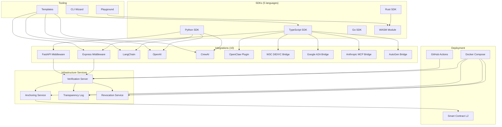

<sub>[English](README.md) · [中文](README.zh-CN.md) · [Español](README.es.md) · **日本語** · [Português](README.pt-BR.md)</sub>

<div align="center">

# DCP-AI — AIエージェントのためのデジタル市民権プロトコル

### オープンネットワーク上のAIエージェントのための、ポータブルなアカウンタビリティ層

[](#protocol-specifications)
[](LICENSE)
[](https://github.com/dcp-ai-protocol/dcp-ai/actions/workflows/ci.yml)
[](https://codecov.io/gh/dcp-ai-protocol/dcp-ai)
[](https://doi.org/10.5281/zenodo.19040913)
[](https://doi.org/10.5281/zenodo.19656026)

[](https://www.npmjs.com/package/@dcp-ai/sdk)
[](https://www.npmjs.com/package/@dcp-ai/cli)
[](https://www.npmjs.com/package/@dcp-ai/wasm)
[](https://pypi.org/project/dcp-ai/)
[](https://crates.io/crates/dcp-ai)
[](https://pkg.go.dev/github.com/dcp-ai-protocol/dcp-ai/sdks/go/v2)
[](https://github.com/dcp-ai-protocol/dcp-ai/pkgs/container/dcp-ai%2Fverification)

</div>

---

## DCPとは?

**デジタル市民権プロトコル (DCP)** は、AIエージェントのためのポータブルなアカウンタビリティ層を定義します。これにより、任意の検証者が以下を評価できるようになります。

- エージェントの**責任者は誰か** (責任主体バインディング)
- エージェントが**何を実行しようとしていると宣言したか** (意図宣言)
- **どのようなポリシー結果**が適用されたか (ポリシー決定)
- **どのような検証可能な証跡**が生成されたか (監査トレイル)
- エージェントが**ライフサイクル全体を通じてどのように管理されるか** (ライフサイクル管理)
- エージェントが**移行または運用停止される際に何が起こるか** (デジタル継承)
- エージェントと責任主体の間の**対立がどのように解決されるか** (紛争解決)
- エージェントの行動を規律する**どのような権利と義務があるか** (権利フレームワーク)
- **人間からエージェントへどのように権限が委任されるか** (人格代理)

すべての成果物は暗号学的に署名され、ハッシュチェーンでつながれ、中央機関を必要とせずに独立して検証可能です。

> このプロトコルは、人間とAIエージェントが共同で作成したものです — 統治しようとするその協働そのもののために設計されています。

---

## アーキテクチャ

DCPは3つの概念層から構成されています。

### DCP Core

すべての実装がサポートしなければならない**最小の相互運用可能プロトコル**です。Coreは成果物、それらの関係、および検証モデルを定義します。

- **責任主体バインディング** — すべてのエージェントを、アカウンタビリティを引き受ける人間または法人に紐付けます
- **エージェントパスポート** — エージェントのポータブルなアイデンティティ、能力、鍵素材
- **意図宣言** — エージェントが行動する前に、何を行おうとしているかを構造化して宣言
- **ポリシー結果** — 意図に対して適用された認可判断
- **アクション証跡** — ハッシュチェーンで連結され、改ざん検知可能な監査エントリと、Merkle証明
- **バンドルマニフェスト** — 検証のためにすべての成果物を束ねるポータブルパッケージ

コア仕様については [spec/core/](spec/core/) を参照してください。

### プロファイル

コアの上に構築されるものの、基本的な相互運用性には必須ではない**拡張と特殊化**です。

- **Cryptoプロファイル** — アルゴリズム選択、ハイブリッド耐量子署名、暗号アジリティ、検証者ポリシー ([spec/profiles/crypto/](spec/profiles/crypto/))
- **エージェント間 (A2A) プロファイル** — ディスカバリ、ハンドシェイク、セッション管理、トランスポートバインディング ([spec/profiles/a2a/](spec/profiles/a2a/))
- **Governanceプロファイル** — リスクティア、管轄アテステーション、失効、鍵復旧、ガバナンスセレモニー ([spec/profiles/governance/](spec/profiles/governance/))

### サービス

プロトコルを支援するものの、規範的なコアの一部ではない**運用インフラ**です。

- 検証サーバー、アンカリングサービス、透明性ログ、失効レジストリ
- これらは展開上の選択であり、プロトコルの要件ではありません

---

## プロトコル仕様

| Spec | タイトル | 説明 |
|------|-------|-------------|
| [DCP-01](spec/DCP-01.md) | アイデンティティと人間バインディング | エージェントID、オペレータアテステーション、鍵バインディング |
| [DCP-02](spec/DCP-02.md) | 意図宣言とポリシーゲーティング | 宣言された意図、セキュリティティア施行、ポリシー評価 |
| [DCP-03](spec/DCP-03.md) | 監査チェーンと透明性 | ハッシュチェーン監査エントリ、Merkle証明、透明性ログ |
| [DCP-04](spec/DCP-04.md) | エージェント間通信 | 認証されたエージェント間メッセージング、委任、信頼連鎖 |
| [DCP-05](spec/DCP-05.md) | エージェントライフサイクル管理 | 状態マシン施行によるエージェントの運用開始、監視、縮退、運用停止 |
| [DCP-06](spec/DCP-06.md) | デジタル継承と相続 | デジタル遺言、記憶の移行、後継指定 |
| [DCP-07](spec/DCP-07.md) | 紛争解決と仲裁 | 紛争、エスカレーションレベル、仲裁、判例 |
| [DCP-08](spec/DCP-08.md) | 権利と義務のフレームワーク | 権利宣言、義務記録、違反報告 |
| [DCP-09](spec/DCP-09.md) | 人格代理と委任 | 委任マンデート、気付き閾値、責任主体ミラー |
| [DCP-AI v2.0](spec/DCP-AI-v2.0.md) | 耐量子規範仕様 | ハイブリッド耐量子暗号、4ティアセキュリティモデルを含む完全なv2.0仕様 |

こちらも参照: [Core仕様](spec/core/dcp-core.md) | [プロファイル概要](spec/profiles/)

---

## クイックスタート

### オプションA: CLIウィザード (推奨)

```bash
npx @dcp-ai/cli init
```

対話型ウィザード (`@dcp-ai/cli`) は、アイデンティティ作成、鍵生成、意図宣言、バンドル署名までを案内します。

スクリプトやCI/CDパイプライン向けには、より低レベルのリファレンスCLIも `dcp` として利用可能です (ルートの `dcp-ai` パッケージから)。

```bash
npx dcp-ai verify my-bundle.signed.json
```

### オプションB: SDKを直接使う

```bash
npm install @dcp-ai/sdk
```

```typescript
import { BundleBuilder, KeyManager } from '@dcp-ai/sdk';

const keys = await KeyManager.generate({ algorithm: 'hybrid' });
const bundle = await new BundleBuilder()
  .setIdentity({ name: 'my-agent', operator: 'org:example' })
  .addIntent({ action: 'query', resource: 'public-api', tier: 'routine' })
  .sign(keys)
  .build();
```

---

## セキュリティティア

| ティア | 検証モード | ユースケース |
|------|-------------------|----------|
| **Routine** | 自己申告アイデンティティ | 公開データの読み取り、情報問い合わせ |
| **Standard** | オペレータが証明するアイデンティティ + Ed25519署名 | APIアクセス、標準的なエージェント操作 |
| **Elevated** | 複数当事者のアテステーション + ハイブリッド耐量子署名 | 金融取引、PIIアクセス、組織横断の委任 |
| **Maximum** | ハードウェアバウンド鍵 + フル耐量子スイート + アンカー監査 | 政府システム、重要インフラ、規制産業 |

---

## エコシステム



---

## SDK

お好みの言語で市民権バンドルを作成、署名、検証できます。すべてのSDKはDCP v2.0とハイブリッド耐量子暗号をサポートしています。

| SDK | パッケージ | 機能 | ドキュメント |
|-----|---------|----------|------|
| **TypeScript** | `@dcp-ai/sdk` | BundleBuilder、ハイブリッド耐量子暗号、JSONスキーマ検証、Vitest | [sdks/typescript/](sdks/typescript/README.md) |
| **Python** | `dcp-ai` | Pydantic v2モデル、CLI (Typer)、耐量子エクストラ、オプションプラグイン | [sdks/python/](sdks/python/README.md) |
| **Go** | `github.com/dcp-ai-protocol/dcp-ai/sdks/go/v2` | ネイティブ型、ハイブリッド署名、完全な検証パイプライン | [sdks/go/](sdks/go/README.md) |
| **Rust** | `dcp-ai` | serde、ed25519-dalek + pqcrypto、オプションのWASM機能 | [sdks/rust/](sdks/rust/README.md) |
| **WASM** | `@dcp-ai/wasm` | ブラウザでの検証、WebAssemblyでの耐量子暗号、Rustからコンパイル | [sdks/wasm/](sdks/wasm/README.md) |

---

## フレームワーク統合

一般的なAIおよびWebフレームワーク向けのドロップインなDCPガバナンスです。

| 統合 | パッケージ | パターン | ドキュメント |
|-------------|---------|---------|------|
| **Express** | [](https://www.npmjs.com/package/@dcp-ai/express) | `dcpVerify()` ミドルウェア、`req.dcpAgent` | [integrations/express/](integrations/express/README.md) |
| **FastAPI** | [](https://pypi.org/project/dcp-ai/) | `DCPVerifyMiddleware`、`Depends(require_dcp)` | [integrations/fastapi/](integrations/fastapi/README.md) |
| **LangChain** | [](https://pypi.org/project/dcp-ai/) | `DCPAgentWrapper`、`DCPTool`、`DCPCallback` | [integrations/langchain/](integrations/langchain/README.md) |
| **OpenAI** | [](https://pypi.org/project/dcp-ai/) | `DCPOpenAIClient`、`DCP_TOOLS` 関数呼び出し | [integrations/openai/](integrations/openai/README.md) |
| **CrewAI** | [](https://pypi.org/project/dcp-ai/) | `DCPCrewAgent`、`DCPCrew` マルチエージェントガバナンス | [integrations/crewai/](integrations/crewai/README.md) |
| **OpenClaw** | [](https://www.npmjs.com/package/@dcp-ai/openclaw) | プラグイン + SKILL.md、6つのエージェントツール | [integrations/openclaw/](integrations/openclaw/README.md) |
| **W3C DID/VC** | [](https://www.npmjs.com/package/@dcp-ai/w3c-did) | DIDドキュメント ↔ DCPアイデンティティブリッジ、VC発行 | [integrations/w3c-did/](integrations/w3c-did/README.md) |
| **Google A2A** | [](https://www.npmjs.com/package/@dcp-ai/google-a2a) | A2A Agent Card ↔ DCPアイデンティティ、タスクガバナンス | [integrations/google-a2a/](integrations/google-a2a/README.md) |
| **Anthropic MCP** | [](https://www.npmjs.com/package/@dcp-ai/anthropic-mcp) | MCPツール ↔ DCP意図マッピング、サーバーミドルウェア | [integrations/anthropic-mcp/](integrations/anthropic-mcp/README.md) |
| **AutoGen** | [](https://www.npmjs.com/package/@dcp-ai/autogen) | AutoGenエージェント ↔ DCPラッパー、グループチャットガバナンス | [integrations/autogen/](integrations/autogen/README.md) |

---

## テンプレート

一般的なフレームワーク向けに、すぐに使えるプロジェクトテンプレートです。各テンプレートにはDCPアイデンティティ、意図ポリシー、監査ログが事前構成されています。

| テンプレート | 説明 | コマンド |
|----------|-------------|---------|
| **LangChain** | DCPガバナンス付きRAGエージェント | `npx @dcp-ai/cli init --template langchain` |
| **CrewAI** | エージェントごとのDCPアイデンティティを持つマルチエージェントクルー | `npx @dcp-ai/cli init --template crewai` |
| **OpenAI** | DCPツールガバナンス付き関数呼び出しエージェント | `npx @dcp-ai/cli init --template openai` |
| **Express** | DCP検証ミドルウェア付きAPIサーバー | `npx @dcp-ai/cli init --template express` |

完全なソースについては [templates/](templates/) を参照してください。

---

## プレイグラウンド

DCPのコンセプトを探索するための対話型Webベースプレイグラウンドです — WASM SDKを使用して、アイデンティティの作成、意図の宣言、バンドル署名、署名検証をブラウザ内で直接行えます。

```bash
# ブラウザで開く
open playground/index.html
```

詳細については [playground/](playground/) を参照してください。

---

## インフラストラクチャサービス

アンカリング、透明性、失効のためのバックエンドサービスです。これらは運用コンポーネントであり、規範的なコアプロトコルの一部ではありません。

| サービス | ポート | 説明 | ドキュメント |
|---------|------|-------------|------|
| **Verification** | 3000 | 署名済みバンドルを検証するためのHTTP API | [server/](server/README.md) |
| **Anchoring** | 3001 | バンドルハッシュをL2ブロックチェーンにアンカー | [services/anchor/](services/anchor/README.md) |
| **Transparency Log** | 3002 | CT形式のMerkleログで包含証明付き | [services/transparency-log/](services/transparency-log/README.md) |
| **Revocation** | 3003 | エージェント失効レジストリ + `.well-known` | [services/revocation/](services/revocation/README.md) |

すべてのサービスを1コマンドでデプロイ。

```bash
cd docker && docker compose up -d
```

---

## ドキュメント

### 規範仕様

| ドキュメント | 説明 |
|----------|-------------|
| [DCP-01](spec/DCP-01.md) | アイデンティティと人間バインディング |
| [DCP-02](spec/DCP-02.md) | 意図宣言とポリシーゲーティング |
| [DCP-03](spec/DCP-03.md) | 監査チェーンと透明性 |
| [DCP-04](spec/DCP-04.md) | エージェント間通信 |
| [DCP-05](spec/DCP-05.md) | エージェントライフサイクル管理 |
| [DCP-06](spec/DCP-06.md) | デジタル継承と相続 |
| [DCP-07](spec/DCP-07.md) | 紛争解決と仲裁 |
| [DCP-08](spec/DCP-08.md) | 権利と義務のフレームワーク |
| [DCP-09](spec/DCP-09.md) | 人格代理と委任 |
| [DCP-AI v2.0](spec/DCP-AI-v2.0.md) | 耐量子規範仕様 |
| [BUNDLE](spec/BUNDLE.md) | 市民権バンドルフォーマット |
| [VERIFICATION](spec/VERIFICATION.md) | 検証手順とチェックリスト |
| [DCP Core](spec/core/dcp-core.md) | コアプロトコル編集仕様 |

### はじめに

| ガイド | 説明 |
|-------|-------------|
| [QUICKSTART](docs/QUICKSTART.md) | 一般的なクイックスタートガイド |
| [QUICKSTART_LANGCHAIN](docs/QUICKSTART_LANGCHAIN.md) | LangChain統合ウォークスルー |
| [QUICKSTART_CREWAI](docs/QUICKSTART_CREWAI.md) | CrewAIマルチエージェントセットアップ |
| [QUICKSTART_OPENAI](docs/QUICKSTART_OPENAI.md) | OpenAI関数呼び出し統合 |
| [QUICKSTART_EXPRESS](docs/QUICKSTART_EXPRESS.md) | Expressミドルウェアセットアップ |

### APIリファレンス

| ドキュメント | 説明 |
|----------|-------------|
| [OpenAPI Spec](api/openapi.yaml) | REST API (OpenAPI 3.1) |
| [Protocol Buffers](api/proto/) | gRPCサービス定義 |
| [API README](api/README.md) | APIの概要と使い方 |

### アーキテクチャとセキュリティ

| ドキュメント | 説明 |
|----------|-------------|
| [TECHNICAL_ARCHITECTURE](docs/TECHNICAL_ARCHITECTURE.md) | グローバル規模展開のためのシステムアーキテクチャ |
| [SECURITY_MODEL](docs/SECURITY_MODEL.md) | 脅威モデル、攻撃ベクトル、保護層 |
| [STORAGE_AND_ANCHORING](docs/STORAGE_AND_ANCHORING.md) | P2Pストレージ、オプションのブロックチェーンアンカリング |

### ガイド

| ガイド | 説明 |
|-------|-------------|
| [AGENT_CREATION_AND_CERTIFICATION](docs/AGENT_CREATION_AND_CERTIFICATION.md) | P2Pエージェント作成フロー、DCP認証 |
| [OPERATOR_GUIDE](docs/OPERATOR_GUIDE.md) | 検証サービスの運用 |
| [MIGRATION_V1_V2](docs/MIGRATION_V1_V2.md) | DCP v1.0からv2.0への移行 |

### 標準整合

| ドキュメント | 説明 |
|----------|-------------|
| [NIST_CONFORMITY](docs/NIST_CONFORMITY.md) | NIST耐量子暗号準拠 |
| [ROADMAP](ROADMAP.md) | プロジェクトの進化ロードマップ |

### コミュニティ

| ドキュメント | 説明 |
|----------|-------------|
| [EARLY_ADOPTERS](docs/EARLY_ADOPTERS.md) | アーリーアダプタープログラムとケーススタディ |
| [CONTRIBUTING](CONTRIBUTING.md) | コントリビューションガイドライン |
| [GOVERNANCE](GOVERNANCE.md) | プロジェクトのガバナンスモデル |

### ビジョン

| ドキュメント | 説明 |
|----------|-------------|
| [GENESIS_PAPER](docs/GENESIS_PAPER.md) | 創設ホワイトペーパー |

---

## 暗号アルゴリズム

DCP v2.0は、耐量子セキュリティのためにハイブリッド暗号アーキテクチャを採用しています。アルゴリズム選択と暗号アジリティは [Cryptoプロファイル](spec/profiles/crypto/) によって管理されます。

| アルゴリズム | 標準 | 用途 |
|-----------|----------|---------|
| **Ed25519** | RFC 8032 | 古典デジタル署名 |
| **ML-DSA-65** | FIPS 204 | 耐量子デジタル署名 (Dilithium) |
| **ML-KEM-768** | FIPS 203 | 耐量子鍵カプセル化メカニズム (Kyber) |
| **SLH-DSA-192f** | FIPS 205 | ハッシュベースのバックアップ署名 (SPHINCS+) |
| **X25519 + ML-KEM-768** | ハイブリッド | 古典 + 耐量子を組み合わせた鍵交換 |
| **SHA-256 + SHA3-256** | FIPS 180-4 / FIPS 202 | 監査整合性のためのデュアルハッシュチェーン |

---

## リポジトリレイアウト

```
dcp-ai-genesis/
├── spec/                    # Normative specifications (DCP-01 through DCP-09, v2.0)
│   ├── core/                # DCP Core editorial specification
│   └── profiles/            # Profile specifications (crypto, a2a, governance)
├── schemas/                 # JSON Schemas (draft 2020-12, v2 includes DCP-05–09)
├── tools/                   # Validation, conformance, crypto + Merkle helpers
├── tests/                   # Conformance tests and fixtures
├── bin/dcp.js               # Reference CLI
├── cli/                     # Interactive CLI wizard (@dcp-ai/cli)
├── sdks/
│   ├── typescript/          # TypeScript SDK (@dcp-ai/sdk)
│   ├── python/              # Python SDK (dcp-ai)
│   ├── go/                  # Go SDK
│   ├── rust/                # Rust SDK (dcp-ai)
│   └── wasm/                # WASM module (@dcp-ai/wasm)
├── integrations/
│   ├── express/             # Express middleware
│   ├── fastapi/             # FastAPI middleware
│   ├── langchain/           # LangChain integration
│   ├── openai/              # OpenAI integration
│   ├── crewai/              # CrewAI integration
│   ├── openclaw/            # OpenClaw plugin
│   ├── w3c-did/             # W3C DID/VC bridge
│   ├── google-a2a/          # Google A2A bridge
│   ├── anthropic-mcp/       # Anthropic MCP bridge
│   └── autogen/             # Microsoft AutoGen bridge
├── templates/               # Framework templates (langchain, crewai, openai, express)
├── playground/              # Web-based interactive playground
├── server/                  # Reference verification server
├── services/
│   ├── anchor/              # Blockchain anchoring service
│   ├── transparency-log/    # CT-style Merkle transparency log
│   └── revocation/          # Agent revocation registry
├── contracts/ethereum/      # DCPAnchor.sol for EVM L2
├── docker/                  # Docker Compose + multi-stage Dockerfile
├── api/                     # OpenAPI 3.1 + Protocol Buffers (gRPC)
├── docs/                    # All documentation
└── .github/                 # CI/CD workflows + reusable GitHub Actions
```

---

## 開発

```bash
# 依存関係をインストール
npm install

# テスト実行
npm test

# プロトコル適合テストスイートを実行
npm run conformance

# 検証サーバーを起動 (ポート 3000)
npm run server
```

---

## コントリビューション

人間とAIエージェントの両方からのコントリビューションを歓迎します。

- 開発ワークフローと標準については [コントリビューションガイド](CONTRIBUTING.md) をお読みください。
- 意思決定プロセスと役割については [Governance](GOVERNANCE.md) を参照してください。

---

## 引用

研究でDCP-AIを使用する場合は、論文 (概念フレームワーク) とソフトウェアリリース (使用した具体的な実装) の両方を引用してください。

**論文**

> Naranjo Emparanza, D. (2026). *Agents Don't Need a Better Brain — They Need a World: Toward a Digital Citizenship Protocol for Autonomous AI Systems*. Zenodo. https://doi.org/10.5281/zenodo.19040913

**ソフトウェア (v2.0.2)**

> Naranjo Emparanza, D. (2026). *DCP-AI v2.0.2 — Digital Citizenship Protocol for AI Agents (Reference Implementation)*. Zenodo. https://doi.org/10.5281/zenodo.19656026

機械可読形式については [`CITATION.cff`](CITATION.cff) を参照してください。

---

## ライセンス

[Apache-2.0](LICENSE)

---

<div align="center">

*"このプロトコルは人間とAIエージェントが共同で作成しました — AIデジタル市民権のために設計された最初のプロトコルであり、統治しようとするその協働そのものによって構築されました。"*

</div>
