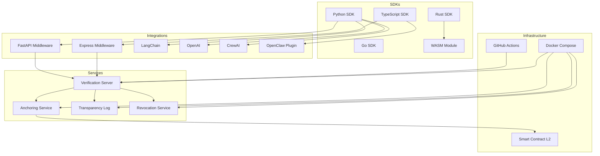

# DCP-AI (Digital Citizenship Protocol for AI Agents) — Genesis Repo

A protocol so that no AI agent operates on open networks without a declared, verifiable, and auditable digital citizenship. This repo is the reference implementation: schemas, CLI, and conformance.

A minimal, protocol-first reference implementation for:

- DCP-01: Identity & Human Binding
- DCP-02: Intent Declaration & Policy Gating
- DCP-03: Audit Chain & Transparency
- Bundle: `citizenship_bundle.json` + `citizenship_bundle.signed.json`
- CLI: `dcp` (validate, conformance, bundle signing & verification)

## Install

```bash
npm install
npm link
```

## Quickstart

```bash
# Run protocol conformance (auto-generates keys + signed fixture if missing)
npm run conformance

# Validate one object
dcp validate schemas/v1/intent.schema.json tests/conformance/examples/intent.json

# Validate a full bundle
dcp validate-bundle tests/conformance/examples/citizenship_bundle.json

# Keygen + sign + verify
dcp keygen keys
dcp sign-bundle tests/conformance/examples/citizenship_bundle.json keys/secret_key.txt tests/conformance/examples/citizenship_bundle.signed.json
dcp verify-bundle tests/conformance/examples/citizenship_bundle.signed.json keys/public_key.txt
```

## Documentation

- **Normative:** [spec/](spec/) — DCP-01, DCP-02, DCP-03, [BUNDLE](spec/BUNDLE.md), [VERIFICATION](spec/VERIFICATION.md). Schemas in `schemas/v1/`, examples in `tests/conformance/examples/`.
- **Production examples:** Regenerate with `npm run examples:generate`. Real Ed25519 signatures, intent_hash (SHA-256 canonical intent), chained prev_hash (GENESIS → hash(entry1)).
- **Storage & anchoring (P2P):** [docs/STORAGE_AND_ANCHORING.md](docs/STORAGE_AND_ANCHORING.md) — no central service; verification is local; optional anchoring (hashes only) via existing blockchain or third-party log.
- **Agent creation & certification:** [docs/AGENT_CREATION_AND_CERTIFICATION.md](docs/AGENT_CREATION_AND_CERTIFICATION.md) — P2P flow, DCP-certified (local + optional anchor), no central API.
- **Operator guide — running a verification service:** [docs/OPERATOR_GUIDE.md](docs/OPERATOR_GUIDE.md) — how to deploy an optional "agent verified" HTTP API (verify bundles, optional anchor); for third parties. Reference server: `npm run server` ([server/README.md](server/README.md)).
- **Government deployment:** [docs/GOVERNMENT_DEPLOYMENT.md](docs/GOVERNMENT_DEPLOYMENT.md) — how a government adopts DCP: verification service, revocation list, transparency log, attestation, anchoring. Cost analysis included.
- **Technical architecture (global scale):** [docs/TECHNICAL_ARCHITECTURE.md](docs/TECHNICAL_ARCHITECTURE.md) — SDK multi-language, transparency log, anchor service, middleware, repository structure for worldwide deployment.
- **Security model:** [docs/SECURITY_MODEL.md](docs/SECURITY_MODEL.md) — attack vectors (forged bundles, stolen keys, protocol forks), protection layers (cryptography, attestation, revocation, protocol fingerprints, anchoring). Run `dcp integrity` to verify your schemas match the canonical protocol.
- **Vision & manifesto:** [docs/Dcp-ai_Full_Package_V1.1.md](docs/Dcp-ai_Full_Package_V1.1.md).
- **Whitepaper (genesis):** [docs/GENESIS_PAPER.md](docs/GENESIS_PAPER.md).

## Troubleshooting (validation failures)

When validation fails, use the error message and schema name to fix the issue. Common cases:

| Error | Cause | Fix |
|-------|--------|-----|
| **INVALID** + path + message | Object does not match JSON Schema. | Check the field (e.g. `dcp_version` must be `"1.0"`, `expires_at` date-time or null). See [spec/DCP-01.md](spec/DCP-01.md), [spec/DCP-02.md](spec/DCP-02.md), [spec/DCP-03.md](spec/DCP-03.md) for required fields. |
| **Bundle invalid: human_binding_record (etc.) failed** | That part of the bundle failed schema validation. | Fix the JSON for that artifact and run `dcp validate-bundle` again. |
| **SIGNATURE INVALID** | Public key does not match the signature. | Use the key that signed the bundle, or run `dcp keygen` and re-sign with `dcp sign-bundle`. |
| **BUNDLE HASH MISMATCH** | Bundle was modified after signing. | Rebuild the bundle and re-sign with `dcp sign-bundle`. |
| **MERKLE ROOT MISMATCH** | audit_entries reordered or modified after signing. | Ensure intent_hash and prev_hash chain match [spec/DCP-03.md](spec/DCP-03.md); use `dcp intent-hash` and GENESIS → hash(entry_{n-1}). |
| **intent_hash (entry i): expected X, got Y** | intent_hash must be SHA-256(canonical(intent)). | Run `dcp intent-hash <intent.json>` and set that value (hex) in the audit_entry. |
| **prev_hash chain (entry i): expected X, got Y** | First entry: prev_hash = "GENESIS"; next: prev_hash = SHA-256(canonical(previous entry)). | See [spec/DCP-03.md](spec/DCP-03.md). |

Full verification checklist: [spec/VERIFICATION.md](spec/VERIFICATION.md).

## Ecosystem

This repository includes a complete ecosystem of SDKs, framework integrations, infrastructure services, and tooling for implementing DCP at scale.



### SDKs

Create, sign, and verify Citizenship Bundles in your preferred language.

| SDK | Package | Features | Docs |
|-----|---------|----------|------|
| **TypeScript** | `@dcp-ai/sdk` | BundleBuilder, Ed25519, JSON Schema validation, Vitest | [sdks/typescript/](sdks/typescript/README.md) |
| **Python** | `dcp-ai` | Pydantic v2 models, CLI (Typer), optional extras | [sdks/python/](sdks/python/README.md) |
| **Go** | `github.com/dcp-ai/dcp-ai-go` | Native types, Ed25519, full verification | [sdks/go/](sdks/go/README.md) |
| **Rust** | `dcp-ai` | serde, ed25519-dalek, optional WASM feature | [sdks/rust/](sdks/rust/README.md) |
| **WASM** | `@dcp-ai/wasm` | Browser verification, compiled from Rust | [sdks/wasm/](sdks/wasm/README.md) |

### Framework Integrations

Drop-in DCP governance for popular AI and web frameworks.

| Integration | Package | Pattern | Docs |
|-------------|---------|---------|------|
| **Express** | `@dcp-ai/express` | `dcpVerify()` middleware, `req.dcpAgent` | [integrations/express/](integrations/express/README.md) |
| **FastAPI** | `dcp-ai[fastapi]` | `DCPVerifyMiddleware`, `Depends(require_dcp)` | [integrations/fastapi/](integrations/fastapi/README.md) |
| **LangChain** | `dcp-ai[langchain]` | `DCPAgentWrapper`, `DCPTool`, `DCPCallback` | [integrations/langchain/](integrations/langchain/README.md) |
| **OpenAI** | `dcp-ai[openai]` | `DCPOpenAIClient`, `DCP_TOOLS` function calling | [integrations/openai/](integrations/openai/README.md) |
| **CrewAI** | `dcp-ai[crewai]` | `DCPCrewAgent`, `DCPCrew` multi-agent | [integrations/crewai/](integrations/crewai/README.md) |
| **OpenClaw** | `@dcp-ai/openclaw` | Plugin + SKILL.md, 6 agent tools | [integrations/openclaw/](integrations/openclaw/README.md) |

### Infrastructure Services

Backend services for anchoring, transparency, and revocation.

| Service | Port | Description | Docs |
|---------|------|-------------|------|
| **Verification** | 3000 | HTTP API for verifying Signed Bundles | [server/](server/README.md) |
| **Anchoring** | 3001 | Anchor bundle hashes to L2 blockchains | [services/anchor/](services/anchor/README.md) |
| **Transparency Log** | 3002 | CT-style Merkle log with inclusion proofs | [services/transparency-log/](services/transparency-log/README.md) |
| **Revocation** | 3003 | Agent revocation registry + `.well-known` | [services/revocation/](services/revocation/README.md) |

### Deployment & Tooling

| Component | Description | Docs |
|-----------|-------------|------|
| **Smart Contract** | `DCPAnchor.sol` for EVM L2 (Base/Arbitrum/Optimism) | [contracts/ethereum/](contracts/ethereum/README.md) |
| **Docker Compose** | All 4 services with health checks, one command | [docker/](docker/README.md) |
| **API Definitions** | OpenAPI 3.1 + Protocol Buffers (gRPC) | [api/](api/README.md) |
| **GitHub Actions** | `verify-bundle` and `conformance-test` actions + CI | [.github/](.github/CICD.md) |

## Repository Layout

- `schemas/v1/` — JSON Schemas (draft 2020-12)
- `tools/` — validation, conformance, crypto + merkle helpers
- `tests/conformance/examples/` — minimal fixtures
- `bin/dcp.js` — reference CLI
- `lib/verify.js` — programmatic API (`validateBundle`, `verifySignedBundle`) for use by CLI and verification services
- `server/` — reference verification service (POST /verify); optional, for operators ([server/README.md](server/README.md))
- `protocol_fingerprints.json` — canonical SHA-256 hashes of every schema (for `dcp integrity`)
- `spec/` — normative specs (DCP-01, DCP-02, DCP-03, BUNDLE)
- `docs/` — whitepaper, security model, architecture, government guide
- `sdks/` — TypeScript, Python, Go, Rust, WASM SDKs
- `integrations/` — Express, FastAPI, LangChain, OpenAI, CrewAI, OpenClaw
- `services/` — Anchoring, Transparency Log, Revocation
- `contracts/` — Ethereum/L2 smart contracts
- `docker/` — Docker Compose + multi-stage Dockerfile
- `api/` — OpenAPI spec + Protocol Buffers
- `.github/` — CI workflows + reusable GitHub Actions

## License

Apache-2.0
