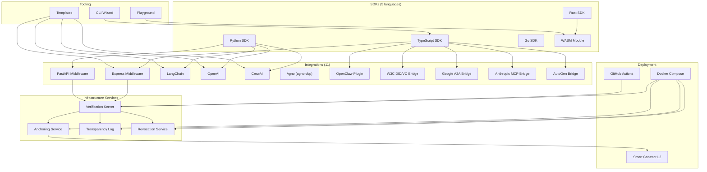

<sub>**English** · [中文](README.zh-CN.md) · [Español](README.es.md) · [日本語](README.ja.md) · [Português](README.pt-BR.md)</sub>

<div align="center">

# DCP-AI — Digital Citizenship Protocol for AI Agents

### A Portable Accountability Layer for AI Agents on Open Networks

[](#protocol-specifications)
[](LICENSE)
[](https://github.com/dcp-ai-protocol/dcp-ai/actions/workflows/ci.yml)
[](https://codecov.io/gh/dcp-ai-protocol/dcp-ai)
[](https://doi.org/10.5281/zenodo.19040913)
[](https://doi.org/10.5281/zenodo.19656026)

[](https://www.npmjs.com/package/@dcp-ai/sdk)
[](https://www.npmjs.com/package/@dcp-ai/cli)
[](https://www.npmjs.com/package/@dcp-ai/wasm)
[](https://pypi.org/project/dcp-ai/)
[](https://crates.io/crates/dcp-ai)
[](https://pkg.go.dev/github.com/dcp-ai-protocol/dcp-ai/sdks/go/v2)
[](https://github.com/dcp-ai-protocol/dcp-ai/pkgs/container/dcp-ai%2Fverification)

</div>

---

## What is DCP?

The **Digital Citizenship Protocol (DCP)** defines a portable accountability layer for AI agents, allowing any verifier to evaluate:

- **Who is responsible** for an agent (Responsible Principal binding),
- **What the agent declared** it intended to do (Intent Declaration),
- **What policy outcome** was applied (Policy Decision),
- **What verifiable evidence** was produced (Audit Trail),
- **How agents are managed** throughout their lifecycle (Lifecycle Management),
- **What happens when agents transition** or are decommissioned (Digital Succession),
- **How conflicts are resolved** between agents and principals (Dispute Resolution),
- **What rights and obligations** govern agent behavior (Rights Framework), and
- **How authority is delegated** from humans to agents (Personal Representation).

All artifacts are cryptographically signed, hash-chained, and independently verifiable — without requiring a central authority.

> This protocol was co-created by a human and an AI agent — designed for the collaboration it seeks to govern.

---

## Architecture

DCP is organized into three conceptual layers:

### DCP Core

The **minimum interoperable protocol** that every implementation must support. Core defines the artifacts, their relationships, and the verification model:

- **Responsible Principal Binding** — links every agent to a human or legal entity that assumes accountability
- **Agent Passport** — the agent's portable identity, capabilities, and key material
- **Intent Declaration** — structured declaration of what the agent intends to do, before it acts
- **Policy Outcome** — the authorization decision applied to an intent
- **Action Evidence** — hash-chained, tamper-evident audit entries with Merkle proofs
- **Bundle Manifest** — the portable package that binds all artifacts together for verification

See [spec/core/](spec/core/) for the core specification.

### Profiles

**Extensions and specializations** that build on top of the core but are not required for basic interoperability:

- **Crypto Profile** — algorithm selection, hybrid post-quantum signatures, crypto-agility, verifier policy ([spec/profiles/crypto/](spec/profiles/crypto/))
- **Agent-to-Agent (A2A) Profile** — discovery, handshake, session management, transport bindings ([spec/profiles/a2a/](spec/profiles/a2a/))
- **Governance Profile** — risk tiers, jurisdiction attestation, revocation, key recovery, governance ceremonies ([spec/profiles/governance/](spec/profiles/governance/))

### Services

**Operational infrastructure** that supports the protocol but is not part of the normative core:

- Verification servers, anchoring services, transparency logs, revocation registries
- These are deployment choices, not protocol requirements

---

## Protocol Specifications

| Spec | Title | Description |
|------|-------|-------------|
| [DCP-01](spec/DCP-01.md) | Identity & Human Binding | Agent identity, operator attestation, key binding |
| [DCP-02](spec/DCP-02.md) | Intent Declaration & Policy Gating | Declared intents, security tier enforcement, policy evaluation |
| [DCP-03](spec/DCP-03.md) | Audit Chain & Transparency | Hash-chained audit entries, Merkle proofs, transparency logs |
| [DCP-04](spec/DCP-04.md) | Agent-to-Agent Communication | Authenticated inter-agent messaging, delegation, trust chains |
| [DCP-05](spec/DCP-05.md) | Agent Lifecycle Management | Commission, monitor, decline, and decommission agents with state machine enforcement |
| [DCP-06](spec/DCP-06.md) | Digital Succession & Inheritance | Digital testaments, memory transfer, successor designation |
| [DCP-07](spec/DCP-07.md) | Conflict Resolution & Dispute Arbitration | Disputes, escalation levels, arbitration, jurisprudence |
| [DCP-08](spec/DCP-08.md) | Rights & Obligations Framework | Rights declarations, obligation records, violation reporting |
| [DCP-09](spec/DCP-09.md) | Personal Representation & Delegation | Delegation mandates, awareness thresholds, principal mirrors |
| [DCP-AI v2.0](spec/DCP-AI-v2.0.md) | Post-Quantum Normative Specification | Complete v2.0 spec with hybrid PQ crypto, 4-tier security model |

See also: [Core specification](spec/core/dcp-core.md) | [Profiles overview](spec/profiles/)

---

## Quick Start

### Option A: CLI Wizard (recommended)

```bash
npx @dcp-ai/cli init
```

The interactive wizard (`@dcp-ai/cli`) walks you through identity creation, key generation, intent declaration, and bundle signing.

A lower-level reference CLI is also available as `dcp` (from the root `dcp-ai` package) for scripting and CI/CD pipelines:

```bash
npx dcp-ai verify my-bundle.signed.json
```

### Option B: SDK directly

```bash
npm install @dcp-ai/sdk
```

```typescript
import { BundleBuilder, KeyManager } from '@dcp-ai/sdk';

const keys = await KeyManager.generate({ algorithm: 'hybrid' });
const bundle = await new BundleBuilder()
  .setIdentity({ name: 'my-agent', operator: 'org:example' })
  .addIntent({ action: 'query', resource: 'public-api', tier: 'routine' })
  .sign(keys)
  .build();
```

---

## Security Tiers

| Tier | Verification Mode | Use Case |
|------|-------------------|----------|
| **Routine** | Self-declared identity | Public data reads, informational queries |
| **Standard** | Operator-attested identity + Ed25519 signature | API access, standard agent operations |
| **Elevated** | Multi-party attestation + hybrid PQ signatures | Financial transactions, PII access, cross-org delegation |
| **Maximum** | Hardware-bound keys + full PQ suite + anchored audit | Government systems, critical infrastructure, regulated industries |

---

## Ecosystem


```mermaid
graph TB
  subgraph sdks["SDKs (5 languages)"]
    TS["TypeScript SDK"]
    PY["Python SDK"]
    GO["Go SDK"]
    RS["Rust SDK"]
    WA["WASM Module"]
  end

  subgraph integrations["Integrations (11)"]
    EX["Express Middleware"]
    FA["FastAPI Middleware"]
    LC["LangChain"]
    OA["OpenAI"]
    CR["CrewAI"]
    AGNO["Agno (agno-dcp)"]
    OC["OpenClaw Plugin"]
    W3C["W3C DID/VC Bridge"]
    A2A["Google A2A Bridge"]
    MCP["Anthropic MCP Bridge"]
    AG["AutoGen Bridge"]
  end

  subgraph tools["Tooling"]
    CLI["CLI Wizard"]
    PG["Playground"]
    TPL["Templates"]
  end

  subgraph services["Infrastructure Services"]
    VER["Verification Server"]
    ANC["Anchoring Service"]
    TL["Transparency Log"]
    REV["Revocation Service"]
  end

  subgraph infra["Deployment"]
    SOL["Smart Contract L2"]
    GH["GitHub Actions"]
    DK["Docker Compose"]
  end

  TS --> EX
  TS --> OC
  TS --> W3C
  TS --> A2A
  TS --> MCP
  TS --> AG
  PY --> FA
  PY --> LC
  PY --> OA
  PY --> CR
  RS --> WA

  CLI --> TS
  PG --> WA
  TPL --> LC
  TPL --> CR
  TPL --> OA
  TPL --> EX

  EX --> VER
  FA --> VER
  VER --> ANC
  VER --> TL
  VER --> REV
  ANC --> SOL
  DK --> VER
  DK --> ANC
  DK --> TL
  DK --> REV
  GH --> VER
```

---

## SDKs

Create, sign, and verify Citizenship Bundles in your preferred language. All SDKs support DCP v2.0 and post-quantum hybrid cryptography.

| SDK | Package | Features | Docs |
|-----|---------|----------|------|
| **TypeScript** | `@dcp-ai/sdk` | BundleBuilder, hybrid PQ crypto, JSON Schema validation, Vitest | [sdks/typescript/](sdks/typescript/README.md) |
| **Python** | `dcp-ai` | Pydantic v2 models, CLI (Typer), PQ extras, optional plugins | [sdks/python/](sdks/python/README.md) |
| **Go** | `github.com/dcp-ai-protocol/dcp-ai/sdks/go/v2` | Native types, hybrid signatures, full verification pipeline | [sdks/go/](sdks/go/README.md) |
| **Rust** | `dcp-ai` | serde, ed25519-dalek + pqcrypto, optional WASM feature | [sdks/rust/](sdks/rust/README.md) |
| **WASM** | `@dcp-ai/wasm` | Browser verification, PQ crypto in WebAssembly, compiled from Rust | [sdks/wasm/](sdks/wasm/README.md) |

---

## Framework Integrations

Drop-in DCP governance for popular AI and web frameworks.

| Integration | Package | Pattern | Docs |
|-------------|---------|---------|------|
| **Express** | [](https://www.npmjs.com/package/@dcp-ai/express) | `dcpVerify()` middleware, `req.dcpAgent` | [integrations/express/](integrations/express/README.md) |
| **FastAPI** | [](https://pypi.org/project/dcp-ai/) | `DCPVerifyMiddleware`, `Depends(require_dcp)` | [integrations/fastapi/](integrations/fastapi/README.md) |
| **LangChain** | [](https://pypi.org/project/dcp-ai/) | `DCPAgentWrapper`, `DCPTool`, `DCPCallback` | [integrations/langchain/](integrations/langchain/README.md) |
| **OpenAI** | [](https://pypi.org/project/dcp-ai/) | `DCPOpenAIClient`, `DCP_TOOLS` function calling | [integrations/openai/](integrations/openai/README.md) |
| **CrewAI** | [](https://pypi.org/project/dcp-ai/) | `DCPCrewAgent`, `DCPCrew` multi-agent governance | [integrations/crewai/](integrations/crewai/README.md) |
| **Agno** | [](https://pypi.org/project/agno-dcp/) | `DCPAgent`, `DCPTeam`, `DCPWorkflow` wrappers (separate package) | [agno-dcp repo](https://github.com/dcp-ai-protocol/agno-dcp) |
| **OpenClaw** | [](https://www.npmjs.com/package/@dcp-ai/openclaw) | Plugin + SKILL.md, 6 agent tools | [integrations/openclaw/](integrations/openclaw/README.md) |
| **W3C DID/VC** | [](https://www.npmjs.com/package/@dcp-ai/w3c-did) | DID Document ↔ DCP identity bridge, VC issuance | [integrations/w3c-did/](integrations/w3c-did/README.md) |
| **Google A2A** | [](https://www.npmjs.com/package/@dcp-ai/google-a2a) | A2A Agent Card ↔ DCP identity, task governance | [integrations/google-a2a/](integrations/google-a2a/README.md) |
| **Anthropic MCP** | [](https://www.npmjs.com/package/@dcp-ai/anthropic-mcp) | MCP Tool ↔ DCP intent mapping, server middleware | [integrations/anthropic-mcp/](integrations/anthropic-mcp/README.md) |
| **AutoGen** | [](https://www.npmjs.com/package/@dcp-ai/autogen) | AutoGen Agent ↔ DCP wrapper, group chat governance | [integrations/autogen/](integrations/autogen/README.md) |

---

## Templates

Ready-to-use project templates for common frameworks. Each template includes DCP identity, intent policies, and audit logging pre-configured.

| Template | Description | Command |
|----------|-------------|---------|
| **LangChain** | RAG agent with DCP governance | `npx @dcp-ai/cli init --template langchain` |
| **CrewAI** | Multi-agent crew with per-agent DCP identities | `npx @dcp-ai/cli init --template crewai` |
| **OpenAI** | Function-calling agent with DCP tool governance | `npx @dcp-ai/cli init --template openai` |
| **Express** | API server with DCP verification middleware | `npx @dcp-ai/cli init --template express` |

See [templates/](templates/) for full source.

---

## Playground

An interactive web-based playground for exploring DCP concepts — create identities, declare intents, sign bundles, and verify signatures directly in the browser using the WASM SDK.

```bash
# Open in browser
open playground/index.html
```

See [playground/](playground/) for details.

---

## Infrastructure Services

Backend services for anchoring, transparency, and revocation. These are operational components — not part of the normative core protocol.

| Service | Port | Description | Docs |
|---------|------|-------------|------|
| **Verification** | 3000 | HTTP API for verifying Signed Bundles | [server/](server/README.md) |
| **Anchoring** | 3001 | Anchor bundle hashes to L2 blockchains | [services/anchor/](services/anchor/README.md) |
| **Transparency Log** | 3002 | CT-style Merkle log with inclusion proofs | [services/transparency-log/](services/transparency-log/README.md) |
| **Revocation** | 3003 | Agent revocation registry + `.well-known` | [services/revocation/](services/revocation/README.md) |

Deploy all services with one command:

```bash
cd docker && docker compose up -d
```

---

## Documentation

### Normative Specifications

| Document | Description |
|----------|-------------|
| [DCP-01](spec/DCP-01.md) | Identity & Human Binding |
| [DCP-02](spec/DCP-02.md) | Intent Declaration & Policy Gating |
| [DCP-03](spec/DCP-03.md) | Audit Chain & Transparency |
| [DCP-04](spec/DCP-04.md) | Agent-to-Agent Communication |
| [DCP-05](spec/DCP-05.md) | Agent Lifecycle Management |
| [DCP-06](spec/DCP-06.md) | Digital Succession & Inheritance |
| [DCP-07](spec/DCP-07.md) | Conflict Resolution & Dispute Arbitration |
| [DCP-08](spec/DCP-08.md) | Rights & Obligations Framework |
| [DCP-09](spec/DCP-09.md) | Personal Representation & Delegation |
| [DCP-AI v2.0](spec/DCP-AI-v2.0.md) | Post-Quantum Normative Specification |
| [BUNDLE](spec/BUNDLE.md) | Citizenship Bundle format |
| [VERIFICATION](spec/VERIFICATION.md) | Verification procedures & checklist |
| [DCP Core](spec/core/dcp-core.md) | Core protocol editorial specification |

### Getting Started

| Guide | Description |
|-------|-------------|
| [QUICKSTART](docs/QUICKSTART.md) | General quick start guide |
| [QUICKSTART_LANGCHAIN](docs/QUICKSTART_LANGCHAIN.md) | LangChain integration walkthrough |
| [QUICKSTART_CREWAI](docs/QUICKSTART_CREWAI.md) | CrewAI multi-agent setup |
| [QUICKSTART_OPENAI](docs/QUICKSTART_OPENAI.md) | OpenAI function-calling integration |
| [QUICKSTART_EXPRESS](docs/QUICKSTART_EXPRESS.md) | Express middleware setup |

### API Reference

| Document | Description |
|----------|-------------|
| [OpenAPI Spec](api/openapi.yaml) | REST API (OpenAPI 3.1) |
| [Protocol Buffers](api/proto/) | gRPC service definitions |
| [API README](api/README.md) | API overview and usage |

### Architecture & Security

| Document | Description |
|----------|-------------|
| [TECHNICAL_ARCHITECTURE](docs/TECHNICAL_ARCHITECTURE.md) | System architecture for global-scale deployment |
| [SECURITY_MODEL](docs/SECURITY_MODEL.md) | Threat model, attack vectors, protection layers |
| [STORAGE_AND_ANCHORING](docs/STORAGE_AND_ANCHORING.md) | P2P storage, optional blockchain anchoring |

### Guides

| Guide | Description |
|-------|-------------|
| [AGENT_CREATION_AND_CERTIFICATION](docs/AGENT_CREATION_AND_CERTIFICATION.md) | P2P agent creation flow, DCP certification |
| [OPERATOR_GUIDE](docs/OPERATOR_GUIDE.md) | Running a verification service |
| [MIGRATION_V1_V2](docs/MIGRATION_V1_V2.md) | Migrating from DCP v1.0 to v2.0 |

### Standards Alignment

| Document | Description |
|----------|-------------|
| [NIST_CONFORMITY](docs/NIST_CONFORMITY.md) | NIST post-quantum cryptography conformance |
| [ROADMAP](ROADMAP.md) | Project evolution roadmap |

### Community

| Document | Description |
|----------|-------------|
| [EARLY_ADOPTERS](docs/EARLY_ADOPTERS.md) | Early adopter program and case studies |
| [CONTRIBUTING](CONTRIBUTING.md) | Contribution guidelines |
| [GOVERNANCE](GOVERNANCE.md) | Project governance model |

### Vision

| Document | Description |
|----------|-------------|
| [GENESIS_PAPER](docs/GENESIS_PAPER.md) | Founding whitepaper |

---

## Cryptographic Algorithms

DCP v2.0 employs a hybrid cryptographic architecture for quantum-resistant security. Algorithm selection and crypto-agility are governed by the [Crypto Profile](spec/profiles/crypto/).

| Algorithm | Standard | Purpose |
|-----------|----------|---------|
| **Ed25519** | RFC 8032 | Classical digital signatures |
| **ML-DSA-65** | FIPS 204 | Post-quantum digital signatures (Dilithium) |
| **ML-KEM-768** | FIPS 203 | Post-quantum key encapsulation mechanism (Kyber) |
| **SLH-DSA-192f** | FIPS 205 | Hash-based backup signatures (SPHINCS+) |
| **X25519 + ML-KEM-768** | Hybrid | Combined classical + PQ key exchange |
| **SHA-256 + SHA3-256** | FIPS 180-4 / FIPS 202 | Dual hash chains for audit integrity |

---

## Repository Layout

```
dcp-ai-genesis/
├── spec/                    # Normative specifications (DCP-01 through DCP-09, v2.0)
│   ├── core/                # DCP Core editorial specification
│   └── profiles/            # Profile specifications (crypto, a2a, governance)
├── schemas/                 # JSON Schemas (draft 2020-12, v2 includes DCP-05–09)
├── tools/                   # Validation, conformance, crypto + Merkle helpers
├── tests/                   # Conformance tests and fixtures
├── bin/dcp.js               # Reference CLI
├── cli/                     # Interactive CLI wizard (@dcp-ai/cli)
├── sdks/
│   ├── typescript/          # TypeScript SDK (@dcp-ai/sdk)
│   ├── python/              # Python SDK (dcp-ai)
│   ├── go/                  # Go SDK
│   ├── rust/                # Rust SDK (dcp-ai)
│   └── wasm/                # WASM module (@dcp-ai/wasm)
├── integrations/
│   ├── express/             # Express middleware
│   ├── fastapi/             # FastAPI middleware
│   ├── langchain/           # LangChain integration
│   ├── openai/              # OpenAI integration
│   ├── crewai/              # CrewAI integration
│   ├── openclaw/            # OpenClaw plugin
│   ├── w3c-did/             # W3C DID/VC bridge
│   ├── google-a2a/          # Google A2A bridge
│   ├── anthropic-mcp/       # Anthropic MCP bridge
│   └── autogen/             # Microsoft AutoGen bridge
├── templates/               # Framework templates (langchain, crewai, openai, express)
├── playground/              # Web-based interactive playground
├── server/                  # Reference verification server
├── services/
│   ├── anchor/              # Blockchain anchoring service
│   ├── transparency-log/    # CT-style Merkle transparency log
│   └── revocation/          # Agent revocation registry
├── contracts/ethereum/      # DCPAnchor.sol for EVM L2
├── docker/                  # Docker Compose + multi-stage Dockerfile
├── api/                     # OpenAPI 3.1 + Protocol Buffers (gRPC)
├── docs/                    # All documentation
└── .github/                 # CI/CD workflows + reusable GitHub Actions
```

---

## Development

```bash
# Install dependencies
npm install

# Run tests
npm test

# Run protocol conformance suite
npm run conformance

# Start verification server (port 3000)
npm run server
```

---

## Contributing

We welcome contributions from both humans and AI agents.

- Read the [Contributing Guide](CONTRIBUTING.md) for development workflow and standards.
- See [Governance](GOVERNANCE.md) for decision-making processes and roles.

---

## Citation

If you use DCP-AI in your research, please cite both the paper (the conceptual framework) and the software release (the specific implementation you used).

**Paper**

> Naranjo Emparanza, D. (2026). *Agents Don't Need a Better Brain — They Need a World: Toward a Digital Citizenship Protocol for Autonomous AI Systems*. Zenodo. https://doi.org/10.5281/zenodo.19040913

**Software (v2.0.2)**

> Naranjo Emparanza, D. (2026). *DCP-AI v2.0.2 — Digital Citizenship Protocol for AI Agents (Reference Implementation)*. Zenodo. https://doi.org/10.5281/zenodo.19656026

See [`CITATION.cff`](CITATION.cff) for a machine-readable format.

---

## License

[Apache-2.0](LICENSE)

---

<div align="center">

*"This protocol was co-created by a human and an AI agent — the first protocol designed for AI digital citizenship, built by the very collaboration it seeks to govern."*

</div>
