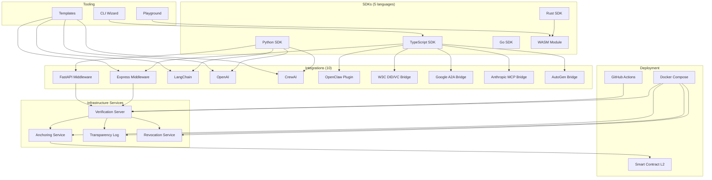

<sub>[English](README.md) · [中文](README.zh-CN.md) · [Español](README.es.md) · [日本語](README.ja.md) · **Português**</sub>

<div align="center">

# DCP-AI — Digital Citizenship Protocol for AI Agents

### Uma Camada Portátil de Prestação de Contas para Agentes de IA em Redes Abertas

[](#especificacoes-de-protocolo)
[](LICENSE)
[](https://github.com/dcp-ai-protocol/dcp-ai/actions/workflows/ci.yml)
[](https://codecov.io/gh/dcp-ai-protocol/dcp-ai)
[](https://doi.org/10.5281/zenodo.19040913)
[](https://doi.org/10.5281/zenodo.19656026)

[](https://www.npmjs.com/package/@dcp-ai/sdk)
[](https://www.npmjs.com/package/@dcp-ai/cli)
[](https://www.npmjs.com/package/@dcp-ai/wasm)
[](https://pypi.org/project/dcp-ai/)
[](https://crates.io/crates/dcp-ai)
[](https://pkg.go.dev/github.com/dcp-ai-protocol/dcp-ai/sdks/go/v2)
[](https://github.com/dcp-ai-protocol/dcp-ai/pkgs/container/dcp-ai%2Fverification)

</div>

---

## O que é o DCP?

O **Digital Citizenship Protocol (DCP)** define uma camada portátil de prestação de contas para agentes de IA, permitindo que qualquer verificador avalie:

- **Quem é responsável** por um agente (vínculo com o Principal Responsável),
- **O que o agente declarou** que pretendia fazer (Declaração de Intenção),
- **Qual decisão de política** foi aplicada (Decisão de Política),
- **Quais evidências verificáveis** foram produzidas (Trilha de Auditoria),
- **Como os agentes são gerenciados** ao longo do ciclo de vida (Gestão de Ciclo de Vida),
- **O que acontece quando os agentes transitam** ou são descomissionados (Sucessão Digital),
- **Como conflitos são resolvidos** entre agentes e principais (Resolução de Disputas),
- **Quais direitos e obrigações** regem o comportamento do agente (Framework de Direitos), e
- **Como a autoridade é delegada** de humanos para agentes (Representação Pessoal).

Todos os artefatos são assinados criptograficamente, encadeados por hash e verificáveis de forma independente — sem exigir uma autoridade central.

> Este protocolo foi co-criado por um humano e um agente de IA — projetado para a colaboração que ele busca governar.

---

## Arquitetura

O DCP está organizado em três camadas conceituais:

### DCP Core

O **protocolo mínimo interoperável** que toda implementação deve suportar. O Core define os artefatos, seus relacionamentos e o modelo de verificação:

- **Vínculo com o Principal Responsável** — liga todo agente a uma pessoa física ou jurídica que assume a responsabilização
- **Passaporte do Agente** — identidade portátil do agente, capacidades e material de chave
- **Declaração de Intenção** — declaração estruturada do que o agente pretende fazer, antes de agir
- **Decisão de Política** — a decisão de autorização aplicada a uma intenção
- **Evidência de Ação** — entradas de auditoria encadeadas por hash, à prova de adulteração, com provas de Merkle
- **Manifesto de Bundle** — o pacote portátil que liga todos os artefatos para verificação

Consulte [spec/core/](spec/core/) para a especificação do core.

### Perfis (Profiles)

**Extensões e especializações** que se apoiam no core mas não são obrigatórias para a interoperabilidade básica:

- **Crypto Profile** — seleção de algoritmos, assinaturas híbridas pós-quânticas, agilidade criptográfica, política do verificador ([spec/profiles/crypto/](spec/profiles/crypto/))
- **Agent-to-Agent (A2A) Profile** — descoberta, handshake, gerenciamento de sessão, bindings de transporte ([spec/profiles/a2a/](spec/profiles/a2a/))
- **Governance Profile** — níveis de risco, atestação de jurisdição, revogação, recuperação de chave, cerimônias de governança ([spec/profiles/governance/](spec/profiles/governance/))

### Serviços

**Infraestrutura operacional** que suporta o protocolo mas não faz parte do core normativo:

- Servidores de verificação, serviços de âncora, logs de transparência, registros de revogação
- São escolhas de implantação, não requisitos do protocolo

---

## Especificações de Protocolo

| Spec | Título | Descrição |
|------|--------|-----------|
| [DCP-01](spec/DCP-01.md) | Identity & Human Binding | Identidade do agente, atestação do operador, vínculo de chave |
| [DCP-02](spec/DCP-02.md) | Intent Declaration & Policy Gating | Intenções declaradas, enforcement por nível de segurança, avaliação de política |
| [DCP-03](spec/DCP-03.md) | Audit Chain & Transparency | Entradas de auditoria encadeadas por hash, provas de Merkle, logs de transparência |
| [DCP-04](spec/DCP-04.md) | Agent-to-Agent Communication | Mensagens autenticadas entre agentes, delegação, cadeias de confiança |
| [DCP-05](spec/DCP-05.md) | Agent Lifecycle Management | Comissionar, monitorar, declinar e descomissionar agentes com enforcement por máquina de estados |
| [DCP-06](spec/DCP-06.md) | Digital Succession & Inheritance | Testamentos digitais, transferência de memória, designação de sucessor |
| [DCP-07](spec/DCP-07.md) | Conflict Resolution & Dispute Arbitration | Disputas, níveis de escalada, arbitragem, jurisprudência |
| [DCP-08](spec/DCP-08.md) | Rights & Obligations Framework | Declarações de direitos, registros de obrigação, relatório de violações |
| [DCP-09](spec/DCP-09.md) | Personal Representation & Delegation | Mandatos de delegação, limiares de ciência, espelhos do principal |
| [DCP-AI v2.0](spec/DCP-AI-v2.0.md) | Post-Quantum Normative Specification | Especificação completa v2.0 com criptografia híbrida PQ, modelo de segurança de 4 níveis |

Veja também: [Especificação do core](spec/core/dcp-core.md) | [Visão geral dos profiles](spec/profiles/)

---

## Início Rápido

### Opção A: Assistente de CLI (recomendado)

```bash
npx @dcp-ai/cli init
```

O assistente interativo (`@dcp-ai/cli`) conduz você pela criação de identidade, geração de chaves, declaração de intenção e assinatura de bundle.

Uma CLI de referência de nível mais baixo também está disponível como `dcp` (do pacote raiz `dcp-ai`) para scripting e pipelines de CI/CD:

```bash
npx dcp-ai verify my-bundle.signed.json
```

### Opção B: SDK diretamente

```bash
npm install @dcp-ai/sdk
```

```typescript
import { BundleBuilder, KeyManager } from '@dcp-ai/sdk';

const keys = await KeyManager.generate({ algorithm: 'hybrid' });
const bundle = await new BundleBuilder()
  .setIdentity({ name: 'my-agent', operator: 'org:example' })
  .addIntent({ action: 'query', resource: 'public-api', tier: 'routine' })
  .sign(keys)
  .build();
```

---

## Níveis de Segurança

| Nível | Modo de Verificação | Caso de Uso |
|-------|---------------------|-------------|
| **Routine** | Identidade auto-declarada | Leituras de dados públicos, consultas informacionais |
| **Standard** | Identidade atestada pelo operador + assinatura Ed25519 | Acesso a API, operações padrão de agente |
| **Elevated** | Atestação multi-parte + assinaturas híbridas pós-quânticas | Transações financeiras, acesso a PII, delegação entre organizações |
| **Maximum** | Chaves vinculadas a hardware + suíte PQ completa + auditoria ancorada | Sistemas governamentais, infraestrutura crítica, setores regulados |

---

## Ecossistema



---

## SDKs

Crie, assine e verifique Bundles de Cidadania (pacotes de cidadania) na sua linguagem preferida. Todos os SDKs suportam DCP v2.0 e criptografia híbrida pós-quântica.

| SDK | Pacote | Recursos | Documentação |
|-----|--------|----------|--------------|
| **TypeScript** | `@dcp-ai/sdk` | BundleBuilder, criptografia híbrida PQ, validação JSON Schema, Vitest | [sdks/typescript/](sdks/typescript/README.md) |
| **Python** | `dcp-ai` | Modelos Pydantic v2, CLI (Typer), extras PQ, plugins opcionais | [sdks/python/](sdks/python/README.md) |
| **Go** | `github.com/dcp-ai-protocol/dcp-ai/sdks/go/v2` | Tipos nativos, assinaturas híbridas, pipeline completo de verificação | [sdks/go/](sdks/go/README.md) |
| **Rust** | `dcp-ai` | serde, ed25519-dalek + pqcrypto, feature WASM opcional | [sdks/rust/](sdks/rust/README.md) |
| **WASM** | `@dcp-ai/wasm` | Verificação no navegador, criptografia PQ em WebAssembly, compilado de Rust | [sdks/wasm/](sdks/wasm/README.md) |

---

## Integrações com Frameworks

Governança DCP drop-in para frameworks populares de IA e web.

| Integração | Pacote | Padrão | Documentação |
|------------|--------|--------|--------------|
| **Express** | [](https://www.npmjs.com/package/@dcp-ai/express) | Middleware `dcpVerify()`, `req.dcpAgent` | [integrations/express/](integrations/express/README.md) |
| **FastAPI** | [](https://pypi.org/project/dcp-ai/) | `DCPVerifyMiddleware`, `Depends(require_dcp)` | [integrations/fastapi/](integrations/fastapi/README.md) |
| **LangChain** | [](https://pypi.org/project/dcp-ai/) | `DCPAgentWrapper`, `DCPTool`, `DCPCallback` | [integrations/langchain/](integrations/langchain/README.md) |
| **OpenAI** | [](https://pypi.org/project/dcp-ai/) | `DCPOpenAIClient`, function calling com `DCP_TOOLS` | [integrations/openai/](integrations/openai/README.md) |
| **CrewAI** | [](https://pypi.org/project/dcp-ai/) | `DCPCrewAgent`, governança multi-agente `DCPCrew` | [integrations/crewai/](integrations/crewai/README.md) |
| **OpenClaw** | [](https://www.npmjs.com/package/@dcp-ai/openclaw) | Plugin + SKILL.md, 6 ferramentas de agente | [integrations/openclaw/](integrations/openclaw/README.md) |
| **W3C DID/VC** | [](https://www.npmjs.com/package/@dcp-ai/w3c-did) | Ponte entre DID Document e identidade DCP, emissão de VC | [integrations/w3c-did/](integrations/w3c-did/README.md) |
| **Google A2A** | [](https://www.npmjs.com/package/@dcp-ai/google-a2a) | A2A Agent Card ↔ identidade DCP, governança de tarefas | [integrations/google-a2a/](integrations/google-a2a/README.md) |
| **Anthropic MCP** | [](https://www.npmjs.com/package/@dcp-ai/anthropic-mcp) | Mapeamento MCP Tool ↔ intenção DCP, middleware do servidor | [integrations/anthropic-mcp/](integrations/anthropic-mcp/README.md) |
| **AutoGen** | [](https://www.npmjs.com/package/@dcp-ai/autogen) | Wrapper AutoGen Agent ↔ DCP, governança de group chat | [integrations/autogen/](integrations/autogen/README.md) |

---

## Templates

Templates de projetos prontos para uso para frameworks comuns. Cada template inclui identidade DCP, políticas de intenção e audit logging pré-configurados.

| Template | Descrição | Comando |
|----------|-----------|---------|
| **LangChain** | Agente RAG com governança DCP | `npx @dcp-ai/cli init --template langchain` |
| **CrewAI** | Crew multi-agente com identidades DCP por agente | `npx @dcp-ai/cli init --template crewai` |
| **OpenAI** | Agente com function-calling e governança de ferramentas DCP | `npx @dcp-ai/cli init --template openai` |
| **Express** | Servidor API com middleware de verificação DCP | `npx @dcp-ai/cli init --template express` |

Consulte [templates/](templates/) para o código completo.

---

## Playground

Um playground web interativo para explorar conceitos do DCP — crie identidades, declare intenções, assine bundles e verifique assinaturas diretamente no navegador usando o SDK WASM.

```bash
# Abrir no navegador
open playground/index.html
```

Consulte [playground/](playground/) para detalhes.

---

## Serviços de Infraestrutura

Serviços de backend para ancoragem, transparência e revogação. Esses são componentes operacionais — não fazem parte do protocolo core normativo.

| Serviço | Porta | Descrição | Documentação |
|---------|-------|-----------|--------------|
| **Verificação** | 3000 | API HTTP para verificar Signed Bundles | [server/](server/README.md) |
| **Ancoragem** | 3001 | Ancora hashes de bundle em blockchains L2 | [services/anchor/](services/anchor/README.md) |
| **Transparency Log** | 3002 | Log Merkle estilo CT com provas de inclusão | [services/transparency-log/](services/transparency-log/README.md) |
| **Revogação** | 3003 | Registro de revogação de agentes + `.well-known` | [services/revocation/](services/revocation/README.md) |

Implante todos os serviços com um comando:

```bash
cd docker && docker compose up -d
```

---

## Documentação

### Especificações Normativas

| Documento | Descrição |
|-----------|-----------|
| [DCP-01](spec/DCP-01.md) | Identity & Human Binding |
| [DCP-02](spec/DCP-02.md) | Intent Declaration & Policy Gating |
| [DCP-03](spec/DCP-03.md) | Audit Chain & Transparency |
| [DCP-04](spec/DCP-04.md) | Agent-to-Agent Communication |
| [DCP-05](spec/DCP-05.md) | Agent Lifecycle Management |
| [DCP-06](spec/DCP-06.md) | Digital Succession & Inheritance |
| [DCP-07](spec/DCP-07.md) | Conflict Resolution & Dispute Arbitration |
| [DCP-08](spec/DCP-08.md) | Rights & Obligations Framework |
| [DCP-09](spec/DCP-09.md) | Personal Representation & Delegation |
| [DCP-AI v2.0](spec/DCP-AI-v2.0.md) | Post-Quantum Normative Specification |
| [BUNDLE](spec/BUNDLE.md) | Formato do Citizenship Bundle |
| [VERIFICATION](spec/VERIFICATION.md) | Procedimentos e checklist de verificação |
| [DCP Core](spec/core/dcp-core.md) | Especificação editorial do protocolo core |

### Primeiros Passos

| Guia | Descrição |
|------|-----------|
| [QUICKSTART](docs/QUICKSTART.md) | Guia geral de início rápido |
| [QUICKSTART_LANGCHAIN](docs/QUICKSTART_LANGCHAIN.md) | Passo-a-passo da integração LangChain |
| [QUICKSTART_CREWAI](docs/QUICKSTART_CREWAI.md) | Configuração multi-agente CrewAI |
| [QUICKSTART_OPENAI](docs/QUICKSTART_OPENAI.md) | Integração function-calling OpenAI |
| [QUICKSTART_EXPRESS](docs/QUICKSTART_EXPRESS.md) | Configuração do middleware Express |

### Referência de API

| Documento | Descrição |
|-----------|-----------|
| [OpenAPI Spec](api/openapi.yaml) | API REST (OpenAPI 3.1) |
| [Protocol Buffers](api/proto/) | Definições de serviço gRPC |
| [API README](api/README.md) | Visão geral e uso da API |

### Arquitetura e Segurança

| Documento | Descrição |
|-----------|-----------|
| [TECHNICAL_ARCHITECTURE](docs/TECHNICAL_ARCHITECTURE.md) | Arquitetura de sistema para implantação em escala global |
| [SECURITY_MODEL](docs/SECURITY_MODEL.md) | Modelo de ameaças, vetores de ataque, camadas de proteção |
| [STORAGE_AND_ANCHORING](docs/STORAGE_AND_ANCHORING.md) | Armazenamento P2P, ancoragem opcional em blockchain |

### Guias

| Guia | Descrição |
|------|-----------|
| [AGENT_CREATION_AND_CERTIFICATION](docs/AGENT_CREATION_AND_CERTIFICATION.md) | Fluxo de criação P2P de agente, certificação DCP |
| [OPERATOR_GUIDE](docs/OPERATOR_GUIDE.md) | Executando um serviço de verificação |
| [MIGRATION_V1_V2](docs/MIGRATION_V1_V2.md) | Migrando do DCP v1.0 para v2.0 |

### Alinhamento com Padrões

| Documento | Descrição |
|-----------|-----------|
| [NIST_CONFORMITY](docs/NIST_CONFORMITY.md) | Conformidade com criptografia pós-quântica do NIST |
| [ROADMAP](ROADMAP.md) | Roadmap de evolução do projeto |

### Comunidade

| Documento | Descrição |
|-----------|-----------|
| [EARLY_ADOPTERS](docs/EARLY_ADOPTERS.md) | Programa de early adopters e estudos de caso |
| [CONTRIBUTING](CONTRIBUTING.md) | Diretrizes de contribuição |
| [GOVERNANCE](GOVERNANCE.md) | Modelo de governança do projeto |

### Visão

| Documento | Descrição |
|-----------|-----------|
| [GENESIS_PAPER](docs/GENESIS_PAPER.md) | Whitepaper fundador |

---

## Algoritmos Criptográficos

O DCP v2.0 emprega uma arquitetura criptográfica híbrida para segurança resistente a computação quântica. A seleção de algoritmos e a agilidade criptográfica são governadas pelo [Crypto Profile](spec/profiles/crypto/).

| Algoritmo | Padrão | Propósito |
|-----------|--------|-----------|
| **Ed25519** | RFC 8032 | Assinaturas digitais clássicas |
| **ML-DSA-65** | FIPS 204 | Assinaturas digitais pós-quânticas (Dilithium) |
| **ML-KEM-768** | FIPS 203 | Mecanismo de encapsulamento de chave pós-quântico (Kyber) |
| **SLH-DSA-192f** | FIPS 205 | Assinaturas de backup baseadas em hash (SPHINCS+) |
| **X25519 + ML-KEM-768** | Híbrido | Troca de chaves clássica + pós-quântica combinada |
| **SHA-256 + SHA3-256** | FIPS 180-4 / FIPS 202 | Cadeias de hash duplas para integridade de auditoria |

---

## Layout do Repositório

```
dcp-ai-genesis/
├── spec/                    # Normative specifications (DCP-01 through DCP-09, v2.0)
│   ├── core/                # DCP Core editorial specification
│   └── profiles/            # Profile specifications (crypto, a2a, governance)
├── schemas/                 # JSON Schemas (draft 2020-12, v2 includes DCP-05–09)
├── tools/                   # Validation, conformance, crypto + Merkle helpers
├── tests/                   # Conformance tests and fixtures
├── bin/dcp.js               # Reference CLI
├── cli/                     # Interactive CLI wizard (@dcp-ai/cli)
├── sdks/
│   ├── typescript/          # TypeScript SDK (@dcp-ai/sdk)
│   ├── python/              # Python SDK (dcp-ai)
│   ├── go/                  # Go SDK
│   ├── rust/                # Rust SDK (dcp-ai)
│   └── wasm/                # WASM module (@dcp-ai/wasm)
├── integrations/
│   ├── express/             # Express middleware
│   ├── fastapi/             # FastAPI middleware
│   ├── langchain/           # LangChain integration
│   ├── openai/              # OpenAI integration
│   ├── crewai/              # CrewAI integration
│   ├── openclaw/            # OpenClaw plugin
│   ├── w3c-did/             # W3C DID/VC bridge
│   ├── google-a2a/          # Google A2A bridge
│   ├── anthropic-mcp/       # Anthropic MCP bridge
│   └── autogen/             # Microsoft AutoGen bridge
├── templates/               # Framework templates (langchain, crewai, openai, express)
├── playground/              # Web-based interactive playground
├── server/                  # Reference verification server
├── services/
│   ├── anchor/              # Blockchain anchoring service
│   ├── transparency-log/    # CT-style Merkle transparency log
│   └── revocation/          # Agent revocation registry
├── contracts/ethereum/      # DCPAnchor.sol for EVM L2
├── docker/                  # Docker Compose + multi-stage Dockerfile
├── api/                     # OpenAPI 3.1 + Protocol Buffers (gRPC)
├── docs/                    # All documentation
└── .github/                 # CI/CD workflows + reusable GitHub Actions
```

---

## Desenvolvimento

```bash
# Instalar dependências
npm install

# Rodar testes
npm test

# Rodar a suíte de conformance do protocolo
npm run conformance

# Iniciar o servidor de verificação (porta 3000)
npm run server
```

---

## Contribuindo

Recebemos contribuições tanto de humanos quanto de agentes de IA.

- Leia o [Guia de Contribuição](CONTRIBUTING.md) para o fluxo de desenvolvimento e padrões.
- Veja [Governance](GOVERNANCE.md) para processos de decisão e papéis.

---

## Citação

Se você usar o DCP-AI na sua pesquisa, por favor cite tanto o artigo (o framework conceitual) quanto o release de software (a implementação específica que você usou).

**Artigo**

> Naranjo Emparanza, D. (2026). *Agents Don't Need a Better Brain — They Need a World: Toward a Digital Citizenship Protocol for Autonomous AI Systems*. Zenodo. https://doi.org/10.5281/zenodo.19040913

**Software (v2.0.2)**

> Naranjo Emparanza, D. (2026). *DCP-AI v2.0.2 — Digital Citizenship Protocol for AI Agents (Reference Implementation)*. Zenodo. https://doi.org/10.5281/zenodo.19656026

Consulte [`CITATION.cff`](CITATION.cff) para um formato legível por máquina.

---

## Licença

[Apache-2.0](LICENSE)

---

<div align="center">

*"Este protocolo foi co-criado por um humano e um agente de IA — o primeiro protocolo desenhado para a cidadania digital da IA, construído pela própria colaboração que ele busca governar."*

</div>
