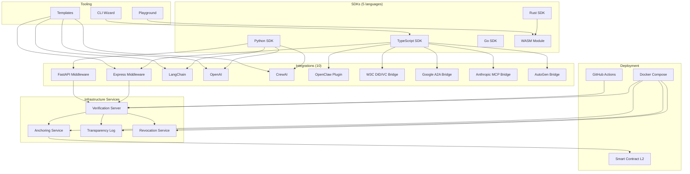

<sub>[English](README.md) · **中文** · [Español](README.es.md) · [日本語](README.ja.md) · [Português](README.pt-BR.md)</sub>

<div align="center">

# DCP-AI — 面向 AI 智能体的数字公民身份协议

### 为开放网络中的 AI 智能体提供可移植的问责层

[](#protocol-specifications)
[](LICENSE)
[](https://github.com/dcp-ai-protocol/dcp-ai/actions/workflows/ci.yml)
[](https://codecov.io/gh/dcp-ai-protocol/dcp-ai)
[](https://doi.org/10.5281/zenodo.19040913)
[](https://doi.org/10.5281/zenodo.19656026)

[](https://www.npmjs.com/package/@dcp-ai/sdk)
[](https://www.npmjs.com/package/@dcp-ai/cli)
[](https://www.npmjs.com/package/@dcp-ai/wasm)
[](https://pypi.org/project/dcp-ai/)
[](https://crates.io/crates/dcp-ai)
[](https://pkg.go.dev/github.com/dcp-ai-protocol/dcp-ai/sdks/go/v2)
[](https://github.com/dcp-ai-protocol/dcp-ai/pkgs/container/dcp-ai%2Fverification)

</div>

---

## 什么是 DCP？

**数字公民身份协议 (DCP)** 为 AI 智能体定义了一个可移植的问责层，使任何验证方都能够评估：

- **谁对一个智能体负责**（责任主体绑定），
- **智能体声明它打算做什么**（意图声明），
- **应用了什么策略结果**（策略裁决），
- **产生了什么可验证的证据**（审计轨迹），
- **如何在整个生命周期中管理智能体**（生命周期管理），
- **当智能体过渡或退役时发生什么**（数字继承），
- **如何解决智能体与主体之间的冲突**（争议解决），
- **哪些权利和义务约束智能体行为**（权利框架），以及
- **如何将权威从人类委派给智能体**（个人代表）。

所有工件均经过加密签名、哈希链化，且可独立验证 —— 无需任何中心化权威。

> 此协议由一位人类和一个 AI 智能体共同创建 —— 为其所要治理的协作而设计。

---

## 架构

DCP 在概念上分为三个层次：

### DCP Core

**最小互操作协议**，每个实现都必须支持。Core 定义了工件、工件之间的关系以及验证模型：

- **责任主体绑定** — 将每个智能体与承担责任的人类或法律实体关联
- **智能体护照** — 智能体的可移植身份、能力与密钥材料
- **意图声明** — 在智能体行动之前，对其意图的结构化声明
- **策略结果** — 针对某个意图的授权裁决
- **行动证据** — 哈希链化、防篡改的审计条目，带 Merkle 证明
- **凭证包清单** — 将所有工件绑定在一起以供验证的可移植包

参见 [spec/core/](spec/core/) 查阅核心规范。

### Profiles（配置文件）

**在核心之上构建的扩展和专门化**，不是基本互操作性的必需项：

- **Crypto Profile** — 算法选择、混合 (经典 + 后量子) 签名、密码学敏捷性、验证方策略 ([spec/profiles/crypto/](spec/profiles/crypto/))
- **智能体间 (A2A) Profile** — 发现、握手、会话管理、传输绑定 ([spec/profiles/a2a/](spec/profiles/a2a/))
- **Governance Profile** — 风险等级、管辖权证明、撤销、密钥恢复、治理仪式 ([spec/profiles/governance/](spec/profiles/governance/))

### 服务

**支持协议的运营基础设施**，但不是规范性核心的一部分：

- 验证服务器、锚定服务、透明度日志、撤销注册表
- 这些是部署选择，而非协议要求

---

## 协议规范

| 规范 | 标题 | 描述 |
|------|-------|-------------|
| [DCP-01](spec/DCP-01.md) | 身份与人类绑定 | 智能体身份、运营方证明、密钥绑定 |
| [DCP-02](spec/DCP-02.md) | 意图声明与策略门控 | 声明的意图、安全等级执行、策略评估 |
| [DCP-03](spec/DCP-03.md) | 审计链与透明度 | 哈希链化审计条目、Merkle 证明、透明度日志 |
| [DCP-04](spec/DCP-04.md) | 智能体间通信 | 经过身份验证的智能体间消息传递、委派、信任链 |
| [DCP-05](spec/DCP-05.md) | 智能体生命周期管理 | 通过状态机执行委任、监控、退役中以及已退役智能体 |
| [DCP-06](spec/DCP-06.md) | 数字继承与继任 | 数字遗嘱、记忆转移、继任者指定 |
| [DCP-07](spec/DCP-07.md) | 冲突解决与争议仲裁 | 争议、升级层级、仲裁、判例 |
| [DCP-08](spec/DCP-08.md) | 权利与义务框架 | 权利声明、义务记录、违规报告 |
| [DCP-09](spec/DCP-09.md) | 个人代表与委派 | 委派授权、感知阈值、主体镜像 |
| [DCP-AI v2.0](spec/DCP-AI-v2.0.md) | 后量子规范性规范 | 完整 v2.0 规范，包含混合后量子加密、4 层安全模型 |

另请参阅：[核心规范](spec/core/dcp-core.md) | [Profile 概览](spec/profiles/)

---

## 快速开始

### 选项 A：CLI 向导（推荐）

```bash
npx @dcp-ai/cli init
```

交互式向导 (`@dcp-ai/cli`) 会引导你完成身份创建、密钥生成、意图声明和凭证包签名。

也可以使用更底层的参考 CLI `dcp`（来自根 `dcp-ai` 包），用于脚本和 CI/CD 流水线：

```bash
npx dcp-ai verify my-bundle.signed.json
```

### 选项 B：直接使用 SDK

```bash
npm install @dcp-ai/sdk
```

```typescript
import { BundleBuilder, KeyManager } from '@dcp-ai/sdk';

const keys = await KeyManager.generate({ algorithm: 'hybrid' });
const bundle = await new BundleBuilder()
  .setIdentity({ name: 'my-agent', operator: 'org:example' })
  .addIntent({ action: 'query', resource: 'public-api', tier: 'routine' })
  .sign(keys)
  .build();
```

---

## 安全等级

| 等级 | 验证模式 | 用例 |
|------|-------------------|----------|
| **Routine** | 自声明身份 | 公共数据读取、信息性查询 |
| **Standard** | 运营方证明身份 + Ed25519 签名 | API 访问、标准智能体操作 |
| **Elevated** | 多方证明 + 混合后量子签名 | 金融交易、PII 访问、跨组织委派 |
| **Maximum** | 硬件绑定密钥 + 完整后量子套件 + 锚定审计 | 政府系统、关键基础设施、受监管行业 |

---

## 生态系统



---

## SDKs

使用你喜欢的语言创建、签名和验证凭证包。所有 SDK 均支持 DCP v2.0 以及后量子混合 (经典 + 后量子) 密码学。

| SDK | 包 | 特性 | 文档 |
|-----|---------|----------|------|
| **TypeScript** | `@dcp-ai/sdk` | BundleBuilder、混合后量子加密、JSON Schema 验证、Vitest | [sdks/typescript/](sdks/typescript/README.md) |
| **Python** | `dcp-ai` | Pydantic v2 模型、CLI (Typer)、后量子可选依赖、可选插件 | [sdks/python/](sdks/python/README.md) |
| **Go** | `github.com/dcp-ai-protocol/dcp-ai/sdks/go/v2` | 原生类型、混合签名、完整验证流水线 | [sdks/go/](sdks/go/README.md) |
| **Rust** | `dcp-ai` | serde、ed25519-dalek + pqcrypto、可选 WASM 特性 | [sdks/rust/](sdks/rust/README.md) |
| **WASM** | `@dcp-ai/wasm` | 浏览器验证、WebAssembly 中的后量子加密，由 Rust 编译 | [sdks/wasm/](sdks/wasm/README.md) |

---

## 框架集成

为流行的 AI 和 Web 框架提供即插即用的 DCP 治理。

| 集成 | 包 | 模式 | 文档 |
|-------------|---------|---------|------|
| **Express** | [](https://www.npmjs.com/package/@dcp-ai/express) | `dcpVerify()` 中间件，`req.dcpAgent` | [integrations/express/](integrations/express/README.md) |
| **FastAPI** | [](https://pypi.org/project/dcp-ai/) | `DCPVerifyMiddleware`、`Depends(require_dcp)` | [integrations/fastapi/](integrations/fastapi/README.md) |
| **LangChain** | [](https://pypi.org/project/dcp-ai/) | `DCPAgentWrapper`、`DCPTool`、`DCPCallback` | [integrations/langchain/](integrations/langchain/README.md) |
| **OpenAI** | [](https://pypi.org/project/dcp-ai/) | `DCPOpenAIClient`、`DCP_TOOLS` 函数调用 | [integrations/openai/](integrations/openai/README.md) |
| **CrewAI** | [](https://pypi.org/project/dcp-ai/) | `DCPCrewAgent`、`DCPCrew` 多智能体治理 | [integrations/crewai/](integrations/crewai/README.md) |
| **OpenClaw** | [](https://www.npmjs.com/package/@dcp-ai/openclaw) | 插件 + SKILL.md，6 个智能体工具 | [integrations/openclaw/](integrations/openclaw/README.md) |
| **W3C DID/VC** | [](https://www.npmjs.com/package/@dcp-ai/w3c-did) | DID Document ↔ DCP 身份桥接，VC 签发 | [integrations/w3c-did/](integrations/w3c-did/README.md) |
| **Google A2A** | [](https://www.npmjs.com/package/@dcp-ai/google-a2a) | A2A Agent Card ↔ DCP 身份，任务治理 | [integrations/google-a2a/](integrations/google-a2a/README.md) |
| **Anthropic MCP** | [](https://www.npmjs.com/package/@dcp-ai/anthropic-mcp) | MCP Tool ↔ DCP 意图映射，服务器中间件 | [integrations/anthropic-mcp/](integrations/anthropic-mcp/README.md) |
| **AutoGen** | [](https://www.npmjs.com/package/@dcp-ai/autogen) | AutoGen Agent ↔ DCP 封装器，群聊治理 | [integrations/autogen/](integrations/autogen/README.md) |

---

## 模板

针对常见框架的即用型项目模板。每个模板都预先配置了 DCP 身份、意图策略和审计日志。

| 模板 | 描述 | 命令 |
|----------|-------------|---------|
| **LangChain** | 带 DCP 治理的 RAG 智能体 | `npx @dcp-ai/cli init --template langchain` |
| **CrewAI** | 多智能体团队，每个智能体有独立 DCP 身份 | `npx @dcp-ai/cli init --template crewai` |
| **OpenAI** | 带 DCP 工具治理的函数调用智能体 | `npx @dcp-ai/cli init --template openai` |
| **Express** | 带 DCP 验证中间件的 API 服务器 | `npx @dcp-ai/cli init --template express` |

完整源代码参见 [templates/](templates/)。

---

## Playground

一个基于 Web 的交互式 Playground，用于探索 DCP 概念 —— 直接在浏览器中使用 WASM SDK 创建身份、声明意图、签名凭证包并验证签名。

```bash
# Open in browser
open playground/index.html
```

详情参见 [playground/](playground/)。

---

## 基础设施服务

用于锚定、透明度和撤销的后端服务。这些是运营组件 —— 不是规范性核心协议的一部分。

| 服务 | 端口 | 描述 | 文档 |
|---------|------|-------------|------|
| **Verification** | 3000 | 用于验证已签名凭证包的 HTTP API | [server/](server/README.md) |
| **Anchoring** | 3001 | 将凭证包哈希锚定到 L2 区块链 | [services/anchor/](services/anchor/README.md) |
| **Transparency Log** | 3002 | CT 风格的 Merkle 日志，带包含性证明 | [services/transparency-log/](services/transparency-log/README.md) |
| **Revocation** | 3003 | 智能体撤销注册表 + `.well-known` | [services/revocation/](services/revocation/README.md) |

一条命令部署所有服务：

```bash
cd docker && docker compose up -d
```

---

## 文档

### 规范性规范

| 文档 | 描述 |
|----------|-------------|
| [DCP-01](spec/DCP-01.md) | 身份与人类绑定 |
| [DCP-02](spec/DCP-02.md) | 意图声明与策略门控 |
| [DCP-03](spec/DCP-03.md) | 审计链与透明度 |
| [DCP-04](spec/DCP-04.md) | 智能体间通信 |
| [DCP-05](spec/DCP-05.md) | 智能体生命周期管理 |
| [DCP-06](spec/DCP-06.md) | 数字继承与继任 |
| [DCP-07](spec/DCP-07.md) | 冲突解决与争议仲裁 |
| [DCP-08](spec/DCP-08.md) | 权利与义务框架 |
| [DCP-09](spec/DCP-09.md) | 个人代表与委派 |
| [DCP-AI v2.0](spec/DCP-AI-v2.0.md) | 后量子规范性规范 |
| [BUNDLE](spec/BUNDLE.md) | 公民凭证包格式 |
| [VERIFICATION](spec/VERIFICATION.md) | 验证流程与清单 |
| [DCP Core](spec/core/dcp-core.md) | 核心协议编辑规范 |

### 入门指南

| 指南 | 描述 |
|-------|-------------|
| [QUICKSTART](docs/QUICKSTART.md) | 通用快速入门指南 |
| [QUICKSTART_LANGCHAIN](docs/QUICKSTART_LANGCHAIN.md) | LangChain 集成分步教程 |
| [QUICKSTART_CREWAI](docs/QUICKSTART_CREWAI.md) | CrewAI 多智能体设置 |
| [QUICKSTART_OPENAI](docs/QUICKSTART_OPENAI.md) | OpenAI 函数调用集成 |
| [QUICKSTART_EXPRESS](docs/QUICKSTART_EXPRESS.md) | Express 中间件设置 |

### API 参考

| 文档 | 描述 |
|----------|-------------|
| [OpenAPI Spec](api/openapi.yaml) | REST API (OpenAPI 3.1) |
| [Protocol Buffers](api/proto/) | gRPC 服务定义 |
| [API README](api/README.md) | API 概览与用法 |

### 架构与安全

| 文档 | 描述 |
|----------|-------------|
| [TECHNICAL_ARCHITECTURE](docs/TECHNICAL_ARCHITECTURE.md) | 面向全球规模部署的系统架构 |
| [SECURITY_MODEL](docs/SECURITY_MODEL.md) | 威胁模型、攻击向量、保护层 |
| [STORAGE_AND_ANCHORING](docs/STORAGE_AND_ANCHORING.md) | P2P 存储、可选区块链锚定 |

### 指南

| 指南 | 描述 |
|-------|-------------|
| [AGENT_CREATION_AND_CERTIFICATION](docs/AGENT_CREATION_AND_CERTIFICATION.md) | P2P 智能体创建流程、DCP 认证 |
| [OPERATOR_GUIDE](docs/OPERATOR_GUIDE.md) | 运行验证服务 |
| [MIGRATION_V1_V2](docs/MIGRATION_V1_V2.md) | 从 DCP v1.0 迁移至 v2.0 |

### 标准对齐

| 文档 | 描述 |
|----------|-------------|
| [NIST_CONFORMITY](docs/NIST_CONFORMITY.md) | NIST 后量子密码学一致性 |
| [ROADMAP](ROADMAP.md) | 项目演进路线图 |

### 社区

| 文档 | 描述 |
|----------|-------------|
| [EARLY_ADOPTERS](docs/EARLY_ADOPTERS.md) | 早期采用者计划与案例研究 |
| [CONTRIBUTING](CONTRIBUTING.md) | 贡献指南 |
| [GOVERNANCE](GOVERNANCE.md) | 项目治理模型 |

### 愿景

| 文档 | 描述 |
|----------|-------------|
| [GENESIS_PAPER](docs/GENESIS_PAPER.md) | 奠基白皮书 |

---

## 密码学算法

DCP v2.0 采用混合 (经典 + 后量子) 密码学架构以实现抗量子安全。算法选择与密码学敏捷性由 [Crypto Profile](spec/profiles/crypto/) 管理。

| 算法 | 标准 | 用途 |
|-----------|----------|---------|
| **Ed25519** | RFC 8032 | 经典数字签名 |
| **ML-DSA-65** | FIPS 204 | 后量子数字签名 (Dilithium) |
| **ML-KEM-768** | FIPS 203 | 后量子密钥封装机制 (Kyber) |
| **SLH-DSA-192f** | FIPS 205 | 基于哈希的备用签名 (SPHINCS+) |
| **X25519 + ML-KEM-768** | 混合 | 组合经典 + 后量子密钥交换 |
| **SHA-256 + SHA3-256** | FIPS 180-4 / FIPS 202 | 审计完整性的双哈希链 |

---

## 仓库布局

```
dcp-ai-genesis/
├── spec/                    # Normative specifications (DCP-01 through DCP-09, v2.0)
│   ├── core/                # DCP Core editorial specification
│   └── profiles/            # Profile specifications (crypto, a2a, governance)
├── schemas/                 # JSON Schemas (draft 2020-12, v2 includes DCP-05–09)
├── tools/                   # Validation, conformance, crypto + Merkle helpers
├── tests/                   # Conformance tests and fixtures
├── bin/dcp.js               # Reference CLI
├── cli/                     # Interactive CLI wizard (@dcp-ai/cli)
├── sdks/
│   ├── typescript/          # TypeScript SDK (@dcp-ai/sdk)
│   ├── python/              # Python SDK (dcp-ai)
│   ├── go/                  # Go SDK
│   ├── rust/                # Rust SDK (dcp-ai)
│   └── wasm/                # WASM module (@dcp-ai/wasm)
├── integrations/
│   ├── express/             # Express middleware
│   ├── fastapi/             # FastAPI middleware
│   ├── langchain/           # LangChain integration
│   ├── openai/              # OpenAI integration
│   ├── crewai/              # CrewAI integration
│   ├── openclaw/            # OpenClaw plugin
│   ├── w3c-did/             # W3C DID/VC bridge
│   ├── google-a2a/          # Google A2A bridge
│   ├── anthropic-mcp/       # Anthropic MCP bridge
│   └── autogen/             # Microsoft AutoGen bridge
├── templates/               # Framework templates (langchain, crewai, openai, express)
├── playground/              # Web-based interactive playground
├── server/                  # Reference verification server
├── services/
│   ├── anchor/              # Blockchain anchoring service
│   ├── transparency-log/    # CT-style Merkle transparency log
│   └── revocation/          # Agent revocation registry
├── contracts/ethereum/      # DCPAnchor.sol for EVM L2
├── docker/                  # Docker Compose + multi-stage Dockerfile
├── api/                     # OpenAPI 3.1 + Protocol Buffers (gRPC)
├── docs/                    # All documentation
└── .github/                 # CI/CD workflows + reusable GitHub Actions
```

---

## 开发

```bash
# Install dependencies
npm install

# Run tests
npm test

# Run protocol conformance suite
npm run conformance

# Start verification server (port 3000)
npm run server
```

---

## 贡献

我们欢迎来自人类和 AI 智能体的贡献。

- 阅读 [贡献指南](CONTRIBUTING.md) 了解开发流程与标准。
- 参阅 [治理](GOVERNANCE.md) 了解决策流程和角色。

---

## 引用

如果你在研究中使用 DCP-AI，请同时引用论文（概念框架）和软件发布（你使用的具体实现）。

**论文**

> Naranjo Emparanza, D. (2026). *Agents Don't Need a Better Brain — They Need a World: Toward a Digital Citizenship Protocol for Autonomous AI Systems*. Zenodo. https://doi.org/10.5281/zenodo.19040913

**软件 (v2.0.2)**

> Naranjo Emparanza, D. (2026). *DCP-AI v2.0.2 — Digital Citizenship Protocol for AI Agents (Reference Implementation)*. Zenodo. https://doi.org/10.5281/zenodo.19656026

机器可读格式参见 [`CITATION.cff`](CITATION.cff)。

---

## 许可证

[Apache-2.0](LICENSE)

---

<div align="center">

*"此协议由一位人类和一个 AI 智能体共同创建 —— 这是第一个为 AI 数字公民身份设计的协议，由其所要治理的协作本身打造。"*

</div>
